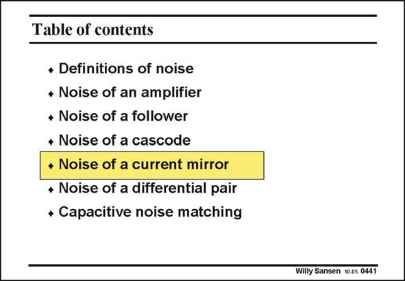

# SANSEN-0441 · Table of contents

章节：04 基本晶体管级的噪声性能  
PDF 页：134；书本页：137；幻灯片编号：0441  
状态：unreviewed



## 对应教材讲解

### PDF 134 · 书本 137

After the noise analysis of the single-transistor configurations, we now consider the two-transistor configurations. A current mirror is taken first now, followed by differential pairs. We already know that a current source transistor should be designed with large V −V or small GS T W/L. Let us see whether this applies to all current sources and mirrors.

## 公式／性能结论候选摘录

以下为规则截取的原文，尚未逐项判读。

（未由规则找到；不代表原页没有此类内容。）

## 曲线结论候选摘录

以下为规则截取的原文，尚未逐项判读。

（未由规则找到；不代表原页没有此类内容。）

## 原文条件与近似候选摘录

以下为规则截取的原文，尚未逐项判读。

（未由规则找到；不代表原页没有此类内容。）

## 幻灯片 OCR（未校正）

```text
Table of contents
• Definitions of noise
• Noise of an amplifier
• Noise of a follower
• Noise of a cascode
+ Noise of a current mirror
• Noise of a differential pair
• Capacitive noise matching
Willy Sansen 10 05 0441
```

数学上下标、分数及正负号以原图为准。电路图已保留；未核对的连接不输出成可仿真 netlist。
