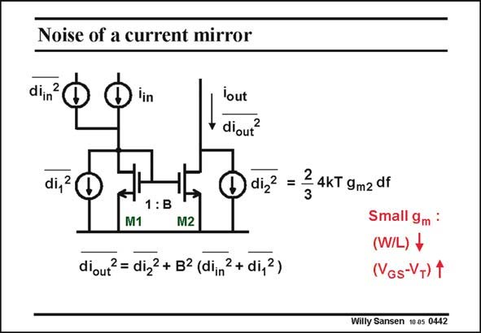

# SANSEN-0442 · Noise of a current mirror

章节：04 基本晶体管级的噪声性能  
PDF 页：135；书本页：138；幻灯片编号：0442  
状态：unreviewed



## 对应教材讲解

### PDF 135 · 书本 138

A simple current mirror is shown in this slide. Its current gain factor is B. All possible noise sources are shown by mean of current sources. The input signal has an input noise source in parallel and both transistors have noise current sources, which are proportional to g . m The total output noise is given below. Clearly all input noise is multiplied by B2. The only way to make the output noise small is to design all devices with large V −V or small W/L, as expected. For GS T later matching (Chapter 12), we will also need to design the current mirrors with small W/L. This is therefore a very attractive result.

## 公式／性能结论候选摘录

以下为规则截取的原文，尚未逐项判读。

- PDF 135: Its current gain factor is B.
- PDF 135: The input signal has an input noise source in parallel and both transistors have noise current sources, which are proportional to g . m The total output noise is given below.
- PDF 135: This is therefore a very attractive result.

## 曲线结论候选摘录

以下为规则截取的原文，尚未逐项判读。

（未由规则找到；不代表原页没有此类内容。）

## 原文条件与近似候选摘录

以下为规则截取的原文，尚未逐项判读。

（未由规则找到；不代表原页没有此类内容。）

## 幻灯片 OCR（未校正）

```text
Noise of a current mirror
diin
lin
di, 2
1:B
M1
M2
diout? = diz2 + B2 (diin2+ di,2)
lout
diout?
diz?
2
=
3
4KT 9m2 df
Small 9m :
(W/L) +
(NGs-V+) 1
Willy Sansen 10 a5 0442
```

数学上下标、分数及正负号以原图为准。电路图已保留；未核对的连接不输出成可仿真 netlist。
