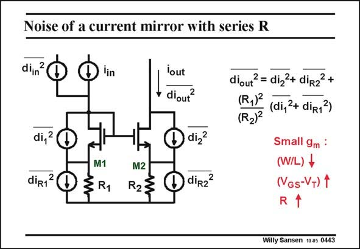

# SANSEN-0443 · Noise of a current mirror with series R

章节：04 基本晶体管级的噪声性能  
PDF 页：135；书本页：138；幻灯片编号：0443  
状态：unreviewed



## 对应教材讲解

### PDF 135 · 书本 138

The noise of a current source can be further reduced by inserting series resistances, as shown in this slide. At first sight, it is a strange concept to add noisy resistors to reduce the noise, but it works. Indeed let us first add all relevant noise sources. The resistor noise sources are modeled by currents, inversely proportional to the resistor values. The total output noise current is given. Instead of trying to analyze this result, let us plot the total output noise versus series resistor. It is shown next.

## 公式／性能结论候选摘录

以下为规则截取的原文，尚未逐项判读。

- PDF 135: The resistor noise sources are modeled by currents, inversely proportional to the resistor values.

## 曲线结论候选摘录

以下为规则截取的原文，尚未逐项判读。

- PDF 135: Instead of trying to analyze this result, let us plot the total output noise versus series resistor.

## 原文条件与近似候选摘录

以下为规则截取的原文，尚未逐项判读。

（未由规则找到；不代表原页没有此类内容。）

## 幻灯片 OCR（未校正）

```text
Noise of a current mirror with series R
N
diin
lin
di,2
diR1
M1
§R1
M2
R2
lout
diout?
diz2
D
diRz
diout? = diz2+ diR22+
(R,)
(di,2+ diR13)
(R2)2
Small gm :
(W/L) +
(VGs-V+) 1
R
Willy Sansen 10 05 0443
```

数学上下标、分数及正负号以原图为准。电路图已保留；未核对的连接不输出成可仿真 netlist。
