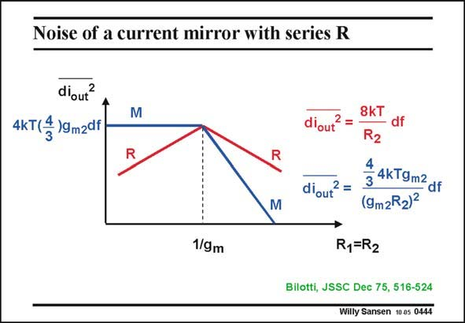

# SANSEN-0444 · Noise of a current mirror with series R

章节：04 基本晶体管级的噪声性能  
PDF 页：136；书本页：139；幻灯片编号：0444  
状态：unreviewed



## 对应教材讲解

### PDF 135 · 书本 138

This log-log plot shows the contributions of the transistors themselves, marked by M, and of the series resistors, marked by R. The current factor B is taken as unity for simplicity. Also both resistors are identical. It is clear that for low resistors the noise of the transistors is dominant. The output noise is

### PDF 136 · 书本 139

simply the sum of the noise power of the two transistors. However, if we increase the resistors to beyond 1/g , m we find two important results: – The transistor noise is decreased as a result of the feedback factor g R . The power is m2 2 decreased by the square of this factor. – Also the total output noise is smaller than before; it has decreased to smaller values. Actually, the resistor noise has taken over the transistor noise. As a result the output noise power decreases inversely proportional to that resistor value. Also their 1/f noise may be much lower. This is a remarkable result. Series resistors will always be used to realize current sources with ultra-low output noise. This is a result that has been known for bipolar transistor current sources since 1975. Why then, is this technique not used routinely for MOST’s?

## 公式／性能结论候选摘录

以下为规则截取的原文，尚未逐项判读。

- PDF 136: However, if we increase the resistors to beyond 1/g , m we find two important results: – The transistor noise is decreased as a result of the feedback factor g R .
- PDF 136: The power is m2 2 decreased by the square of this factor. – Also the total output noise is smaller than before; it has decreased to smaller values.
- PDF 136: As a result the output noise power decreases inversely proportional to that resistor value.

## 曲线结论候选摘录

以下为规则截取的原文，尚未逐项判读。

- PDF 135: This log-log plot shows the contributions of the transistors themselves, marked by M, and of the series resistors, marked by R.

## 原文条件与近似候选摘录

以下为规则截取的原文，尚未逐项判读。

（未由规则找到；不代表原页没有此类内容。）

## 幻灯片 OCR（未校正）

```text
Noise of a current mirror with series R
d'out
2
4KT(* )9m2df
M
R
diout'
2 =
M
1/gm
8K
Ro
4
3 4kT9m2 df
(9m2R2)2
R1=R2
Bilotti, JSSC Dec 75, 516-524
Willy Sansen 10 05 0444
```

数学上下标、分数及正负号以原图为准。电路图已保留；未核对的连接不输出成可仿真 netlist。
