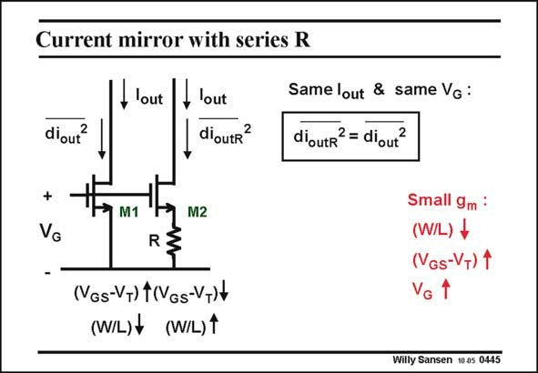

# SANSEN-0445 · Current mirror with series R

章节：04 基本晶体管级的噪声性能  
PDF 页：136；书本页：139；幻灯片编号：0445  
状态：unreviewed



## 对应教材讲解

### PDF 136 · 书本 139

MOST devices have already a technique to reduce the output noise current. They don’t need series resistors. This technique consists of taking large values of V −V or small values of GS T W/L, has already been explained. This gives the same effect as adding series resistors. Indeed let us compare two transistor amplifiers with different V −V and GS T W/L. They have the same Gate voltage V . They also G carry the same DC current. The first one with transistor M1 has a large V −V and hence small W/L. The second one GS T with transistor M2 has a smaller V −V and much larger W/L. The difference in V is taken GS T GS up by a series resistor R. The question is whether they have the same gain or same output noise.

### PDF 137 · 书本 140

The second one has a larger g because its V −V is smaller. The feedback of R, reduces m GS T the gain. As a result they have the same gain. The same is also true for the output noise. The second one generates more output noise current because of the larger g , but it is reduced because of the feedback of R. As a result both m output noise values are the same.

## 公式／性能结论候选摘录

以下为规则截取的原文，尚未逐项判读。

- PDF 136: The question is whether they have the same gain or same output noise.
- PDF 137: The feedback of R, reduces m GS T the gain.
- PDF 137: As a result they have the same gain.
- PDF 137: As a result both m output noise values are the same.

## 曲线结论候选摘录

以下为规则截取的原文，尚未逐项判读。

（未由规则找到；不代表原页没有此类内容。）

## 原文条件与近似候选摘录

以下为规则截取的原文，尚未逐项判读。

- PDF 136: The second one GS T with transistor M2 has a smaller V −V and much larger W/L.

## 幻灯片 OCR（未校正）

```text
Current mirror with series R
,lout
diout?
- lout
dioutr?
Same lout & same Vg :
dioutr? = diout?
+
M1
M2
R
(NGs-V+) t(VGs-VT)+
(W/L)f (W/L)1
Small 9m:
(W/L) +
(VGs-V+) 1
VG
Willy Sansen 10 a5 0445
```

数学上下标、分数及正负号以原图为准。电路图已保留；未核对的连接不输出成可仿真 netlist。
