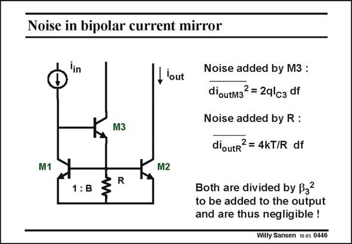

# SANSEN-0446 · Noise in bipolar current mirror

章节：04 基本晶体管级的噪声性能  
PDF 页：137；书本页：140；幻灯片编号：0446  
状态：unreviewed



## 对应教材讲解

### PDF 137 · 书本 140

The output noise current of the popular bipolar current mirror is now examined. Clearly we already know what output noise current is produced by the two current mirror devices M1 and M2. The question is how much noise is contributed by transistor M3 and by the resistor R. The expressions are given in this slide. Transistor M3 gives shot noise whereas the resistor R gives thermal noise. Both inject noise at the common point. As a result they are subject to the feedback loop formed by M1 and M3. This is why their contributions to the output noise power have to divided by b 2. 3 As a result they are negligible.

## 公式／性能结论候选摘录

以下为规则截取的原文，尚未逐项判读。

- PDF 137: As a result they are subject to the feedback loop formed by M1 and M3.
- PDF 137: This is why their contributions to the output noise power have to divided by b 2. 3 As a result they are negligible.

## 曲线结论候选摘录

以下为规则截取的原文，尚未逐项判读。

（未由规则找到；不代表原页没有此类内容。）

## 原文条件与近似候选摘录

以下为规则截取的原文，尚未逐项判读。

（未由规则找到；不代表原页没有此类内容。）

## 幻灯片 OCR（未校正）

```text
Noise in bipolar current mirror
К м3
M1
1:B
I'out
Noise added by M3 :
dioutM3?= 2qlcg df
Noise added by R :
dioutr? = 4kT/R df
K M2
Both are divided by B32
to be added to the output
and are thus negligible !
Willy Sansen 1005 0446
```

数学上下标、分数及正负号以原图为准。电路图已保留；未核对的连接不输出成可仿真 netlist。
