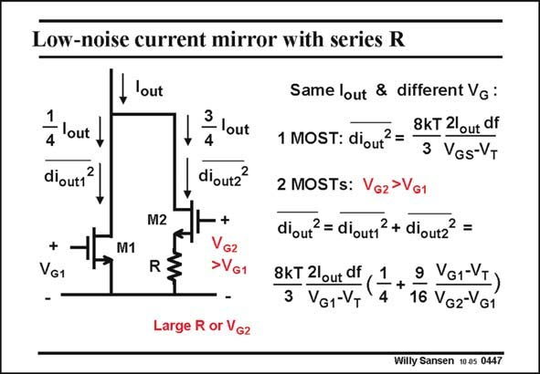

# SANSEN-0447 · Low-noise current mirror with series R

章节：04 基本晶体管级的噪声性能  
PDF 页：137；书本页：140；幻灯片编号：0447  
状态：unreviewed



## 对应教材讲解

### PDF 137 · 书本 140

A circuit technique that is sometimes used to reduce the output noise of a current source is given in this slide. The transistor is split up into parts. One of them, usually the one with the larger current, then receives a series resistor to reduce its noise output. In this example, this latter one takes 3/4 of the total current. How well does this work? Obviously in order to be able to accommodate this series resistor, we need to take a V biasing voltage that is quite large. It is much larger than V . We compare two G2 G1

### PDF 138 · 书本 141

cases. In the first case we have only one single MOST, which takes all the DC current. Its output noise current is then known. In the other case, we take two MOSTs. One has a much larger V than the other. In this G2 case, we have two contributions to the output noise current. The first one is due to transistor M1, which runs at 1/4 of the DC current. The other one is due to the resistor R. This resistor however, must have a value (V −V )/(0.75I ). G2 G1 out Two terms appear in the total noise of the second case. The first one is the transistor noise whereas the second one is due to the resistor. It is clear that we need a really large V to make G2 this work. If we applied that same V to the single MOST of the first case, we would obtain G2 similar noise performance. This technique therefore does not work!

## 公式／性能结论候选摘录

以下为规则截取的原文，尚未逐项判读。

- PDF 138: This technique therefore does not work!

## 曲线结论候选摘录

以下为规则截取的原文，尚未逐项判读。

（未由规则找到；不代表原页没有此类内容。）

## 原文条件与近似候选摘录

以下为规则截取的原文，尚未逐项判读。

- PDF 137: It is much larger than V .
- PDF 138: One has a much larger V than the other.

## 幻灯片 OCR（未校正）

```text
Low-noise current mirror with series R
out
dioutt
2
+
VG1
,lout
M1
M2
R
3
— lout
4
diout2
2
+
VG2
>VG1
Large R or VG2
Same lout & different Vg :
8KT 2lout df
1 MOST: diout*
3 VGs-VT
2 MOSTs: Vg2>VG1
diout?= diouti? + dioutz? =
8kT 2lout df
3 VG1-VT
1
4
VG-VT)
16 VG2-VG1
Willy Sansen 10 a5 0447
```

数学上下标、分数及正负号以原图为准。电路图已保留；未核对的连接不输出成可仿真 netlist。
