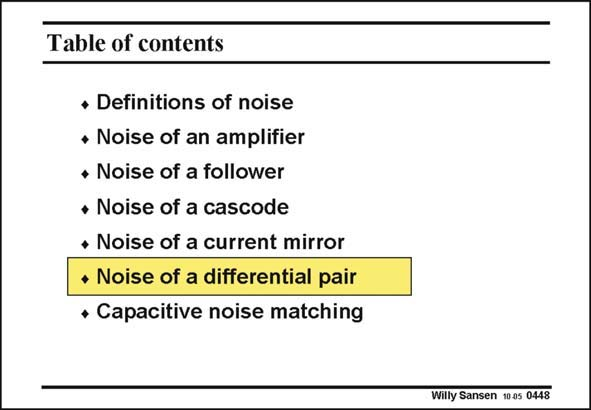

# SANSEN-0448 · Table of contents

章节：04 基本晶体管级的噪声性能  
PDF 页：138；书本页：141；幻灯片编号：0448  
状态：unreviewed



## 对应教材讲解

### PDF 138 · 书本 141

After the noise analysis of the current mirrors, we will discuss the noise performance of a differential pair.

## 公式／性能结论候选摘录

以下为规则截取的原文，尚未逐项判读。

（未由规则找到；不代表原页没有此类内容。）

## 曲线结论候选摘录

以下为规则截取的原文，尚未逐项判读。

（未由规则找到；不代表原页没有此类内容。）

## 原文条件与近似候选摘录

以下为规则截取的原文，尚未逐项判读。

（未由规则找到；不代表原页没有此类内容。）

## 幻灯片 OCR（未校正）

```text
Table of contents
• Definitions of noise
• Noise of an amplifier
• Noise of a follower
• Noise of a cascode
• Noise of a current mirror
• Noise of a differential pair
• Capacitive noise matching
Willy Sansen 10 a5 0448
```

数学上下标、分数及正负号以原图为准。电路图已保留；未核对的连接不输出成可仿真 netlist。
