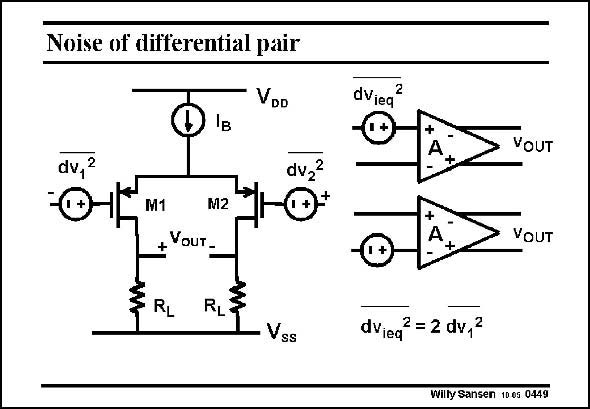

# SANSEN-0449 · Noise of differential pair

章节：04 基本晶体管级的噪声性能  
PDF 页：138；书本页：141；幻灯片编号：0449  
状态：unreviewed



## 对应教材讲解

### PDF 138 · 书本 141

A simple differential amplifier is illustrated in this slide. Both transistors exhibit the same amount of noise, as they carry equal currents. These noise powers are not correlated. They have to be summed up. The question is on which side? The symbol of such a differential amplifier is shown on the right. Do we have to insert the equivalent noise voltage at the positive or at the negative input? The answer is obvious.

### PDF 139 · 书本 142

Both are equivalent! Indeed the noise voltage is squared at the end of the calculations. As a result, it does not make any difference whether the noise is applied to the positive or negative side. We prefer the side where it is easier to do the calculations! As a result, the total equivalent input noise source is simply twice the noise voltage power of one single transistor. A differential amplifier always gives √2 or 41% more input noise voltage than a single amplifier. The lowest-noise amplifiers are single-input. On the other hand, these single-input amplifiers are much more sensitive to substrate noise. The debate on whether to use differential input amplifiers in RF receivers for example, is therefore still ongoing.

## 公式／性能结论候选摘录

以下为规则截取的原文，尚未逐项判读。

- PDF 138: Both transistors exhibit the same amount of noise, as they carry equal currents.
- PDF 139: As a result, it does not make any difference whether the noise is applied to the positive or negative side.
- PDF 139: As a result, the total equivalent input noise source is simply twice the noise voltage power of one single transistor.
- PDF 139: The debate on whether to use differential input amplifiers in RF receivers for example, is therefore still ongoing.

## 曲线结论候选摘录

以下为规则截取的原文，尚未逐项判读。

（未由规则找到；不代表原页没有此类内容。）

## 原文条件与近似候选摘录

以下为规则截取的原文，尚未逐项判读。

（未由规则找到；不代表原页没有此类内容。）

## 幻灯片 OCR（未校正）

```text
Noise of differential pair
VDD
dv,
2
M1
M2
+YouT-
RL
RL
Vss
dviea®
VOUT
VOUT
dVied
2 = 2 dv,2
Willy Sansen 10 os 0449
```

数学上下标、分数及正负号以原图为准。电路图已保留；未核对的连接不输出成可仿真 netlist。
