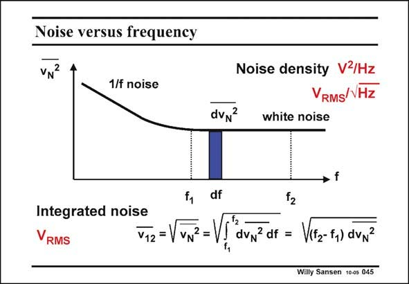

# SANSEN-045 · Noise versus frequency

章节：04 基本晶体管级的噪声性能  
PDF 页：116；书本页：119；幻灯片编号：045  
状态：unreviewed



## 对应教材讲解

### PDF 115 · 书本 118

Fourier has explained how to convert any signal versus time into a signal versus frequency. For noise, we obtain a curve which consists of two regions: – The region of white noise is flat and extends to very high frequencies (1013 Hz).

### PDF 116 · 书本 119

– The region at low frequencies, which is called pink or 1/f noise as the noise power is inversely proportional to the frequency. The noise density is now the noise power in an elementary small frequency band df. Its dimension is V2/Hz. Taking the square root yields VRMS/√Hz. The integrated noise is the total noise power between two frequencies. This integral is easily taken when the noise is white or flat. It is proportional to the difference in frequency. Noise is therefore integrated on a linear frequency axis. Bode diagrams are always presented with a logarithmic axis. They now give the wrong picture. They overemphasize the low-frequency noise. The integrated noise (or also total noise) has V2 as a dimension or V when the square root RMS is taken. The calculation of the integrated noise in the 1/f noise region involves another integral. The main point is not to omit the lower bound frequency. The 1/f noise would go to infinity and so does the integrated noise. It would take an infinite time to measure that however!

## 公式／性能结论候选摘录

以下为规则截取的原文，尚未逐项判读。

- PDF 116: – The region at low frequencies, which is called pink or 1/f noise as the noise power is inversely proportional to the frequency.
- PDF 116: It is proportional to the difference in frequency.
- PDF 116: Noise is therefore integrated on a linear frequency axis.

## 曲线结论候选摘录

以下为规则截取的原文，尚未逐项判读。

- PDF 115: For noise, we obtain a curve which consists of two regions: – The region of white noise is flat and extends to very high frequencies (1013 Hz).
- PDF 116: Noise is therefore integrated on a linear frequency axis.
- PDF 116: Bode diagrams are always presented with a logarithmic axis.

## 原文条件与近似候选摘录

以下为规则截取的原文，尚未逐项判读。

（未由规则找到；不代表原页没有此类内容。）

## 幻灯片 OCR（未校正）

```text
Noise versus frequency
VN
1/f noise
dvN?
Noise density V2/Hz
VRMS/VHz
white noise
df
Integrated noise
RMS
V12 =
dvy2 df = V(F2-f,) dvN2
Willy Sansen 10-0s 045
```

数学上下标、分数及正负号以原图为准。电路图已保留；未核对的连接不输出成可仿真 netlist。
