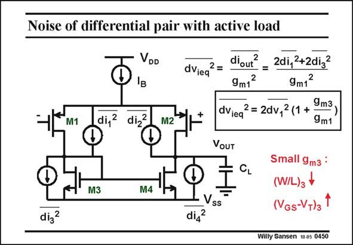

# SANSEN-0450 · Noise of differential pair with active load

章节：04 基本晶体管级的噪声性能  
PDF 页：139；书本页：142；幻灯片编号：0450  
状态：unreviewed



## 对应教材讲解

### PDF 139 · 书本 142

A voltage differential amplifier with single-ended output is shown in this slide. The noise sources of all four transistors are added by their current sources. This is a circuit with two equal halves. If we know the input noise power for one halve, we simply multiply by two. Moreover each half consists of an amplifying transistor loaded by a current source. We already know how to reduce the noise contribution of the current source. We simply design it with a larger V −V . GS T The resulting equivalent input voltage is now what we expected. It contains a factor of two for the two halves. Also it contains the g ratio, which is typical for an active load. m If we succeed in making the load V −V small, then we can limit the input noise to the two GS T input transistors only. However, if we choose the same V −V for all transistors, or if we have GS T bipolar transistors, then the noise of all 4 transistors is equally important!

## 公式／性能结论候选摘录

以下为规则截取的原文，尚未逐项判读。

- PDF 139: This is a circuit with two equal halves.
- PDF 139: Also it contains the g ratio, which is typical for an active load. m If we succeed in making the load V −V small, then we can limit the input noise to the two GS T input transistors only.
- PDF 139: However, if we choose the same V −V for all transistors, or if we have GS T bipolar transistors, then the noise of all 4 transistors is equally important!

## 曲线结论候选摘录

以下为规则截取的原文，尚未逐项判读。

（未由规则找到；不代表原页没有此类内容。）

## 原文条件与近似候选摘录

以下为规则截取的原文，尚未逐项判读。

（未由规则找到；不代表原页没有此类内容。）

## 幻灯片 OCR（未校正）

```text
Noise of differential pair with active load
VDD
IB
dViea
2=
M1
di,2
di,z
M2
diout?
9m12
2di,2+2dig?
2
9m1
dVieq
2 =2dv,2 (1 + 9m3,
9m1
VOUT
CL
M3
M4
dig2
V
di42
SS
Small 9m3 :
(W/L)з
(VGs-VT)3
Willy Sansen 10 05 0450
```

数学上下标、分数及正负号以原图为准。电路图已保留；未核对的连接不输出成可仿真 netlist。
