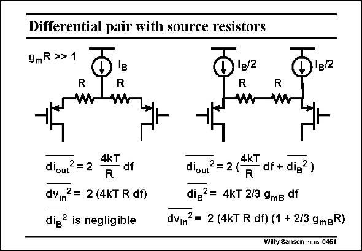

# SANSEN-0451 · Differential pair with source resistors

章节：04 基本晶体管级的噪声性能  
PDF 页：140；书本页：143；幻灯片编号：0451  
状态：unreviewed



## 对应教材讲解

### PDF 139 · 书本 142

Differential pairs with large V −V values are actually called transconductors. If we cannot GS T make the V −V sufficiently large, because of velocity saturation, we can still add resistors. In GS T both cases we assume equal resistors and we also take g R>1. m For small signals both realizations are equivalent. Indeed their gains are the same. How about noise? First of all, we notice that in the first case, DC current I /2 flows through the resistors R, B which is not true in the second case. We therefore need a larger DC supply voltage. Moreover, the noise performance is quite different. In the first case the equivalent input noise voltage is the noise contributed by both resistors. This is because for g R>1, the transistor m noise is negligible.

### PDF 140 · 书本 143

Note that the noise contributed by the DC current source I is altogether negli- B gible, as it is a commonmode signal, cancelled by the differential output. In the second case, the noise from the DC current sources I /2 (with transcon- B ductance g ) is not negligimB ble. On the contrary it is the dominant noise source. This is the main disadvantage of the second case!

## 公式／性能结论候选摘录

以下为规则截取的原文，尚未逐项判读。

- PDF 139: In GS T both cases we assume equal resistors and we also take g R>1. m For small signals both realizations are equivalent.
- PDF 139: We therefore need a larger DC supply voltage.

## 曲线结论候选摘录

以下为规则截取的原文，尚未逐项判读。

（未由规则找到；不代表原页没有此类内容。）

## 原文条件与近似候选摘录

以下为规则截取的原文，尚未逐项判读。

- PDF 139: If we cannot GS T make the V −V sufficiently large, because of velocity saturation, we can still add resistors.
- PDF 139: In GS T both cases we assume equal resistors and we also take g R>1. m For small signals both realizations are equivalent.

## 幻灯片 OCR（未校正）

```text
Differential pair with source resistors
9mR>>
R
'в
R
R
M
R
diout =2
4kT
df
R
dvin2 = 2 (4kT R df)
dig? is negligible
4kT
diout? = 2 (
R
df + dig?)
dig?= 4kT 2/3 gmB df
dvin?= 2 (4kT R df) (1 + 2/3 gmgR)
Willy Sansen 10 0s 0451
```

数学上下标、分数及正负号以原图为准。电路图已保留；未核对的连接不输出成可仿真 netlist。
