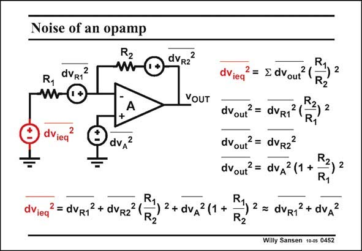

# SANSEN-0452 · Noise of an opamp

章节：04 基本晶体管级的噪声性能  
PDF 页：140；书本页：143；幻灯片编号：0452  
状态：unreviewed



## 对应教材讲解

### PDF 140 · 书本 143

Finally, let us have a look at the noise performance of an opamp with resistive feedback. We assume that the overall voltage gain is large, i.e. that R is much larger than 2 R . 1 We can distinguish three sources of noise, i.e. the two resistors and the opamp itself, which has an input noise voltage source v . A Calculation of the contributions of these three voltage sources to the output and division by the voltage gain R /R , allows us to determine the total equivalent input noise 2 1 voltage power. For large gain, the noise voltage of the input resistor R and of the opamp are the dominant 1 noise sources. This is to be expected. The input resistor R is in series with the input signal. Also the opamps 1 noise voltage is its equivalent input noise voltage. At the input, it appears unaltered.

## 公式／性能结论候选摘录

以下为规则截取的原文，尚未逐项判读。

- PDF 140: We assume that the overall voltage gain is large, i.e. that R is much larger than 2 R . 1 We can distinguish three sources of noise, i.e. the two resistors and the opamp itself, which has an input noise voltage source v .
- PDF 140: A Calculation of the contributions of these three voltage sources to the output and division by the voltage gain R /R , allows us to determine the total equivalent input noise 2 1 voltage power.
- PDF 140: For large gain, the noise voltage of the input resistor R and of the opamp are the dominant 1 noise sources.

## 曲线结论候选摘录

以下为规则截取的原文，尚未逐项判读。

（未由规则找到；不代表原页没有此类内容。）

## 原文条件与近似候选摘录

以下为规则截取的原文，尚未逐项判读。

- PDF 140: We assume that the overall voltage gain is large, i.e. that R is much larger than 2 R . 1 We can distinguish three sources of noise, i.e. the two resistors and the opamp itself, which has an input noise voltage source v .

## 幻灯片 OCR（未校正）

```text
Noise of an opamp
Rz
R1
dvR12
dViea
A
dvA?
dVieq
2= dVR12 + dVR2
dvR22
dVieq
2 = ≤ dVout
VOUT
R.
dvout?= dVR1 (
R
2
dvout?= dVR2?
dvout? = dvA (1 +
R,
R2) 2+ du,211+
R.
-) 2 = dVR12+ dvA2
Willy Sansen 10-0s 0452
2
```

数学上下标、分数及正负号以原图为准。电路图已保留；未核对的连接不输出成可仿真 netlist。
