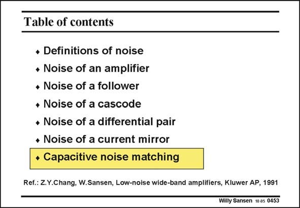

# SANSEN-0453 · Table of contents

章节：04 基本晶体管级的噪声性能  
PDF 页：141；书本页：144；幻灯片编号：0453  
状态：unreviewed



## 对应教材讲解

### PDF 140 · 书本 143

For most of the amplifiers, a resistive source impedance was assumed. Indeed, many sensors are resistive such as Wheatstone bridge pressure sensors.

### PDF 141 · 书本 144

Many sensors are capacitive, however. Photodiodes and radiation detectors are capacitive, but so are capacitive accelerometers, microphones, etc. The question is then, what transistor biasing provides the best noise performance? This is called capacitive noise matching. Quite often this analysis leads to complicated expressions. They have been simplified to the bare minimum. Also the design plan has been simplified to a single equation.

## 公式／性能结论候选摘录

以下为规则截取的原文，尚未逐项判读。

（未由规则找到；不代表原页没有此类内容。）

## 曲线结论候选摘录

以下为规则截取的原文，尚未逐项判读。

（未由规则找到；不代表原页没有此类内容。）

## 原文条件与近似候选摘录

以下为规则截取的原文，尚未逐项判读。

- PDF 140: For most of the amplifiers, a resistive source impedance was assumed.

## 幻灯片 OCR（未校正）

```text
Table of contents
• Definitions of noise
• Noise of an amplifier
• Noise of a follower
• Noise of a cascode
• Noise of a differential pair
• Noise of a current mirror
• Capacitive noise matching
Ref.: Z.Y.Chang, W.Sansen, Low-noise wide-band amplifiers, Kluwer AP, 1991
Willy Sansen 10 a5 0453
```

数学上下标、分数及正负号以原图为准。电路图已保留；未核对的连接不输出成可仿真 netlist。
