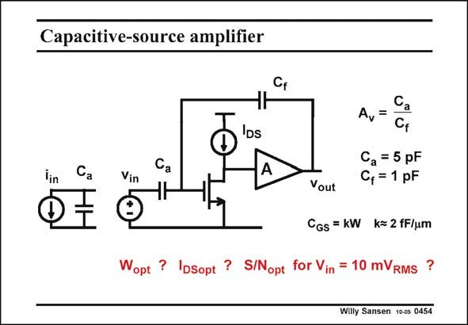

# SANSEN-0454 · Capacitive-source amplifier

章节：04 基本晶体管级的噪声性能  
PDF 页：141；书本页：144；幻灯片编号：0454  
状态：unreviewed



## 对应教材讲解

### PDF 141 · 书本 144

A capacitive sensor can be represented by a current source in parallel or a voltage in series. The latter model is chosen as the calculations are a bit simpler. The optimization provides the same results. The first preamplifier consists of a single transistor loaded by an ideal (or verylow-noise) current source. It is usually followed by another amplifier to have more gain. The feedback loop is carried out by means of a capacitance. Indeed capacitances don’t give any noise. Since the source is capacitive, the feedback element should also be capacitive! The gain A is then simply given by the ratio of the two capacitances. v In this case, the input transistor is the only noisy component. The question then is, what must be its channel width W (for minimum channel length L) and its current I , for minimum opt DSopt noise? What would be its SNR for an input signal of 10 mV ? RMS We cannot forget that the input impedance of the MOST is also capacitive. Its C is GS proportional to the width W, for minimum channel length L. We will use minimum channel length L, because we will end up with very large W/L ratio’s. It is preferable to use minimum channel length then!

## 公式／性能结论候选摘录

以下为规则截取的原文，尚未逐项判读。

- PDF 141: It is usually followed by another amplifier to have more gain.
- PDF 141: The gain A is then simply given by the ratio of the two capacitances. v In this case, the input transistor is the only noisy component.
- PDF 141: Its C is GS proportional to the width W, for minimum channel length L.

## 曲线结论候选摘录

以下为规则截取的原文，尚未逐项判读。

（未由规则找到；不代表原页没有此类内容。）

## 原文条件与近似候选摘录

以下为规则截取的原文，尚未逐项判读。

（未由规则找到；不代表原页没有此类内容。）

## 幻灯片 OCR（未校正）

```text
Capacitive-source amplifier
CF
lin
Vin
'os
Avi
Cf
Vout
Ca = 5 pF
C, = 1 pF
CGs = kW k= 2 fF/um
Wopt ? IDSopt ? S/Nopt for Vin = 10 mVRMS ?
Willy Sansen 100s 0454
```

数学上下标、分数及正负号以原图为准。电路图已保留；未核对的连接不输出成可仿真 netlist。
