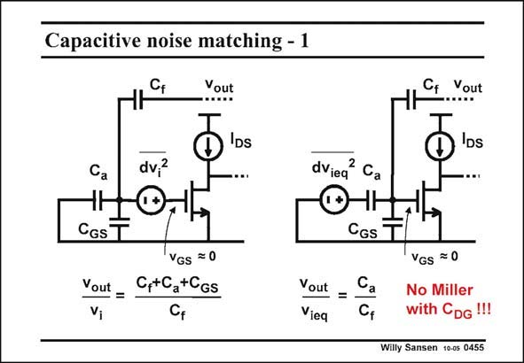

# SANSEN-0455 · Capacitive noise matching - 1

章节：04 基本晶体管级的噪声性能  
PDF 页：142；书本页：145；幻灯片编号：0455  
状态：unreviewed



## 对应教材讲解

### PDF 142 · 书本 145

Now we have to transfer the noise source from the Gate of the MOST to the input of the amplifier. Once the noise source is at the input, the SNR is readily calculated. In order to do so, we calculate the gain from the equivalent input noise voltage to the output, we calculate the gain from the input to the output, and we equate both. The gain from the noise source to the output is the most difficult. Since the feedback loop is still closed by capacitance C , the capacitance ratio c determines the gain. Indeed, the Gate itself acts as a virtual ground. The gain from input to output is simply C /C . a f Equation of both provides the noise contribution of the MOST, transferred to the input.

## 公式／性能结论候选摘录

以下为规则截取的原文，尚未逐项判读。

- PDF 142: In order to do so, we calculate the gain from the equivalent input noise voltage to the output, we calculate the gain from the input to the output, and we equate both.
- PDF 142: The gain from the noise source to the output is the most difficult.
- PDF 142: Since the feedback loop is still closed by capacitance C , the capacitance ratio c determines the gain.
- PDF 142: The gain from input to output is simply C /C . a f Equation of both provides the noise contribution of the MOST, transferred to the input.

## 曲线结论候选摘录

以下为规则截取的原文，尚未逐项判读。

（未由规则找到；不代表原页没有此类内容。）

## 原文条件与近似候选摘录

以下为规则截取的原文，尚未逐项判读。

（未由规则找到；不代表原页没有此类内容。）

## 幻灯片 OCR（未校正）

```text
Capacitive noise matching - 1
Cf
Yout
DS
Cf
Vout
dv.?
CGs T
Yout =
Vị
VGs =0
C,+Ca+CGS
dviea Ca
CGs T
Vout = Ca
Vieq
Cf
VGs = 0
No Miller
with CDG !!!
Willy Sansen 10-0s 0455
```

数学上下标、分数及正负号以原图为准。电路图已保留；未核对的连接不输出成可仿真 netlist。
