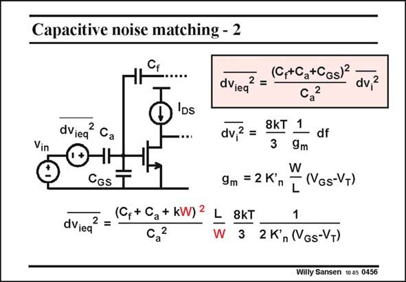

# SANSEN-0456 · Capacitive noise matching - 2

章节：04 基本晶体管级的噪声性能  
PDF 页：142；书本页：145；幻灯片编号：0456  
状态：unreviewed



## 对应教材讲解

### PDF 142 · 书本 145

The noise of the MOST is actually transferred to the input by means of a capacitive transformer. It is clearly amplified, by that capacitance ratio. Note however, that this capacitive ratio depends on the transistor size or transistor width, as C is part of it. GS Rewriting this expression, in terms of transistor width, shows that there is minimum of the input noise versus width W. For small W, it drops out of the numerator and the noise goes down with W. For large W, the kW term overcompensates the W factor in the denominator and the noise goes up with W. It is clear that we will try to make that up-transformation factor as small as possible. The numerator contains all possible capacitances connected to that node. A long coaxial wire for example between the photodiode and the amplifier would add a lot of capacitance, heavily deteriorating the noise performance. This is why all low-noise capacitive sensors have to be integrated together with their preamplifier.

## 公式／性能结论候选摘录

以下为规则截取的原文，尚未逐项判读。

- PDF 142: Note however, that this capacitive ratio depends on the transistor size or transistor width, as C is part of it.

## 曲线结论候选摘录

以下为规则截取的原文，尚未逐项判读。

（未由规则找到；不代表原页没有此类内容。）

## 原文条件与近似候选摘录

以下为规则截取的原文，尚未逐项判读。

（未由规则找到；不代表原页没有此类内容。）

## 幻灯片 OCR（未校正）

```text
Capacitive noise matching - 2
dViea
2 =
(C,+Ca+CGs)
dv,2
DS
dVieq
2 Ca
Vin
CGs T
dVieq
2 =
(C, + Ca + kW) 2
Ca
2
L
W
dv,2 =
9m = 2Kn
8KT
1
df
3
9m
W
- (VGs-VT)
L
8kT
1
3 2 K'n (NGs-VT)
Willy Sansen 10a5 0456
```

数学上下标、分数及正负号以原图为准。电路图已保留；未核对的连接不输出成可仿真 netlist。
