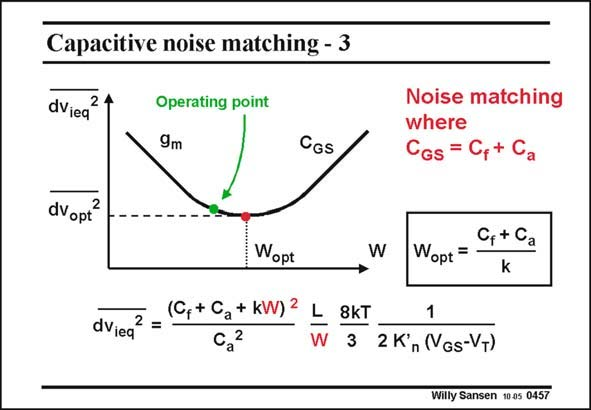

# SANSEN-0457 · Capacitive noise matching - 3

章节：04 基本晶体管级的噪声性能  
PDF 页：143；书本页：146；幻灯片编号：0457  
状态：unreviewed



## 对应教材讲解

### PDF 143 · 书本 146

This expression is given again, together with a plot of the input noise versus width W. There is clearly a minimum. It is obtained at the point where the transistor input capacitance C , GS equals the sum of capacitances, seen by the transistor. For example if the sensor capacitance C =5 pF, a a feedback capacitance of C =1 pF provides a voltage f gain of 5. The optimum width is the W =6/0.002=3000 mm or 3 mm. opt In practice we prefer an operating point on the left of this optimum. The noise is not much worse but the size can be as much as half ! Now that we know the transistor width, we have to know in which technology (L and K∞) we will realize this amplifier. Choosing a V −V =0.2 V then gives us the current I and the GS T DSopt transconductance g . mopt For example for L=0.13 mm, for which K∞ =150 mA/V2, I =138 mA and g =1.38 S. n DSopt mopt The noise resistance 2/3g is then 0.48 V. This is a very low value indeed! mopt

## 公式／性能结论候选摘录

以下为规则截取的原文，尚未逐项判读。

- PDF 143: It is obtained at the point where the transistor input capacitance C , GS equals the sum of capacitances, seen by the transistor.
- PDF 143: For example if the sensor capacitance C =5 pF, a a feedback capacitance of C =1 pF provides a voltage f gain of 5.

## 曲线结论候选摘录

以下为规则截取的原文，尚未逐项判读。

- PDF 143: This expression is given again, together with a plot of the input noise versus width W.

## 原文条件与近似候选摘录

以下为规则截取的原文，尚未逐项判读。

（未由规则找到；不代表原页没有此类内容。）

## 幻灯片 OCR（未校正）

```text
Capacitive noise matching - 3
dViea
2
Operating point
9m
CGS
Noise matching
where
CGs = C,+ C
dVopt'
2
Wopt
dViea
2 =
(C, + Ca + kW) 2
2
a
L
W
C, + Ca
Wopt =
k
8kT
3
1
2 K'n (Gs-VT)
Willy Sansen 10.85. 0457
```

数学上下标、分数及正负号以原图为准。电路图已保留；未核对的连接不输出成可仿真 netlist。
