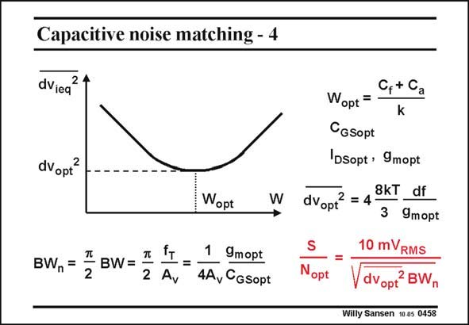

# SANSEN-0458 · Capacitive noise matching - 4

章节：04 基本晶体管级的噪声性能  
PDF 页：143；书本页：146；幻灯片编号：0458  
状态：unreviewed



## 对应教材讲解

### PDF 143 · 书本 146

In order to obtain the SNR, we must find the total or integrated noise. The bandwidth BW is approximated by the f of that input device, T divided by the gain. Parameter f is determined T by the input capacitance C and the transcon- GSopt ductance g . In this mopt example, it is 36 GHz. The noise bandwidth is now 57% larger or 57 GHz. Finally the SNR is then the ratio of the input signal to the total noise. The result is easily calculated! At the optimum the noise power is twice as high, corresponding to 0.48√2 or 0.68 V. The noise density is then about 0.1 nV /√Hz. The integrated noise is then 24 mV . RMS RMS The SNR is finally 417 or 52 dB. This is not band for a 36 GHz amplifier!

## 公式／性能结论候选摘录

以下为规则截取的原文，尚未逐项判读。

- PDF 143: The bandwidth BW is approximated by the f of that input device, T divided by the gain.
- PDF 143: The noise bandwidth is now 57% larger or 57 GHz.

## 曲线结论候选摘录

以下为规则截取的原文，尚未逐项判读。

（未由规则找到；不代表原页没有此类内容。）

## 原文条件与近似候选摘录

以下为规则截取的原文，尚未逐项判读。

- PDF 143: The bandwidth BW is approximated by the f of that input device, T divided by the gain.

## 幻灯片 OCR（未校正）

```text
Capacitive noise matching - 4
dviea
dvopt®
BW,=
Tt
BW=
2
Wopt
=
1
9mopt
2 Av
4A, CGSopt
W
Cf+ Ca
Wopt =
k
CGsopt
'DSopt , 9mopt
dVopr =4 3KT df
3 9mopt
S
Nopt
10 mVRMS
dvopt? BWn
Willy Sansen 10 05 0458
```

数学上下标、分数及正负号以原图为准。电路图已保留；未核对的连接不输出成可仿真 netlist。
