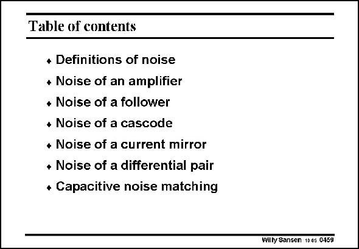

# SANSEN-0459 · Table of contents

章节：04 基本晶体管级的噪声性能  
PDF 页：144；书本页：147；幻灯片编号：0459  
状态：unreviewed



## 对应教材讲解

### PDF 144 · 书本 147

In this Chapter, we have carried out simplified analyses on the noise performance of all elementary circuits. This will allow us to obtain the equivalent input noise on most of the circuitry that follows.

## 公式／性能结论候选摘录

以下为规则截取的原文，尚未逐项判读。

（未由规则找到；不代表原页没有此类内容。）

## 曲线结论候选摘录

以下为规则截取的原文，尚未逐项判读。

（未由规则找到；不代表原页没有此类内容。）

## 原文条件与近似候选摘录

以下为规则截取的原文，尚未逐项判读。

（未由规则找到；不代表原页没有此类内容。）

## 幻灯片 OCR（未校正）

```text
Table of contents
* Definitions of noise
* Noise of an amplifier
• Noise of a follower
• Noise of a cascode
* Noise of a current mirror
• Noise of a differential pair
+ Capacitive noise matching
Willy Sansen 10 0s 0459
```

数学上下标、分数及正负号以原图为准。电路图已保留；未核对的连接不输出成可仿真 netlist。
