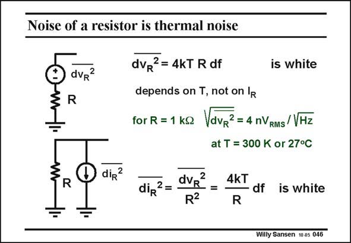

# SANSEN-046 · Noise of a resistor is thermal noise

章节：04 基本晶体管级的噪声性能  
PDF 页：116；书本页：119；幻灯片编号：046  
状态：unreviewed



## 对应教材讲解

### PDF 116 · 书本 119

Let us now determine which noise sources we can find in an electronic circuit. Resistors and junctions give noise. We will take resistors first. A resistor gives thermal noise. It is modeled by a voltage source in series with the resistor or a current source in parallel. The noise voltage is proportional to that resistor, and to the absolute temperature (in Kelvin). It does not depend on the actual current flowing through the resistor. Cooling down will therefore reduce the noise (as in many space applications!). For a resistor of 1 kV, the thermal noise density is about 4 nV /√Hz at room temperature. RMS

### PDF 117 · 书本 120

This is proportional to the square root of the resistor value. A resistor of 100 kV would give 40 nV /√Hz but a resistor of 10 kV only 4×√10 or 12 nV /√Hz. RMS RMS Over a bandwidth from 20 Hz to 20 kHz, the total noise of a 100 kV resistor would be 40×√20 000 nV or 5.6 mV . For a maximum signal amplitude of 100 mV , this would be RMS RMS RMS SNR of 17 700 or 85 dB. Note that the lower bound frequency is usually negligible. Indeed, either subtracting 20 Hz from 20 kHz or not, will not make any difference. Finally, note that a noise current can be used in parallel. The larger this parallel resistor, the lower the noise.

## 公式／性能结论候选摘录

以下为规则截取的原文，尚未逐项判读。

- PDF 116: The noise voltage is proportional to that resistor, and to the absolute temperature (in Kelvin).
- PDF 116: It does not depend on the actual current flowing through the resistor.
- PDF 116: Cooling down will therefore reduce the noise (as in many space applications!).
- PDF 117: This is proportional to the square root of the resistor value.
- PDF 117: RMS RMS Over a bandwidth from 20 Hz to 20 kHz, the total noise of a 100 kV resistor would be 40×√20 000 nV or 5.6 mV .

## 曲线结论候选摘录

以下为规则截取的原文，尚未逐项判读。

（未由规则找到；不代表原页没有此类内容。）

## 原文条件与近似候选摘录

以下为规则截取的原文，尚未逐项判读。

（未由规则找到；不代表原页没有此类内容。）

## 幻灯片 OCR（未校正）

```text
Noise of a resistor is thermal noise
dvR?
R
dvR?=4kT R df
is white
depends on T, not on lR
for R = 1 kg VdvR? = 4 nVRMS/VHz
at T = 300 K or 27°C
D
R
diR?
2
dip?=
dVR
R2
4kT
- df is white
R
Willy Sansen 10 05 046
```

数学上下标、分数及正负号以原图为准。电路图已保留；未核对的连接不输出成可仿真 netlist。
