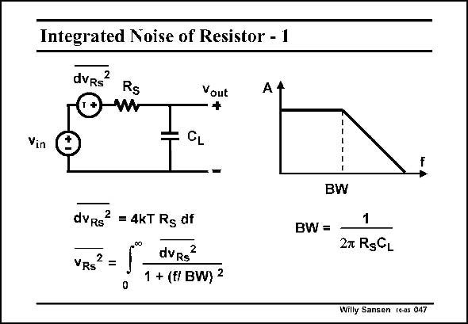

# SANSEN-047 · Integrated Noise of Resistor - 1

章节：04 基本晶体管级的噪声性能  
PDF 页：117；书本页：120；幻灯片编号：047  
状态：unreviewed



## 对应教材讲解

### PDF 117 · 书本 120

The upper frequency limit of a resistor R is normally S determined by a capacitance to ground, denoted by C . L Their time constant determines the bandwidth BW. If we now want to calculate the integrated noise of this resistor-capacitance combination, we have to take the integral over all frequencies. This integral obviously contains the firstorder filter transfer function, related to this bandwidth BW. We now have to perform this integration. Luckily this is a well known integral.

## 公式／性能结论候选摘录

以下为规则截取的原文，尚未逐项判读。

- PDF 117: The upper frequency limit of a resistor R is normally S determined by a capacitance to ground, denoted by C .
- PDF 117: L Their time constant determines the bandwidth BW.
- PDF 117: This integral obviously contains the firstorder filter transfer function, related to this bandwidth BW.

## 曲线结论候选摘录

以下为规则截取的原文，尚未逐项判读。

（未由规则找到；不代表原页没有此类内容。）

## 原文条件与近似候选摘录

以下为规则截取的原文，尚未逐项判读。

（未由规则找到；不代表原页没有此类内容。）

## 幻灯片 OCR（未校正）

```text
Integrated Noise of Resistor - 1
dvRs
Rs
Vout
A 4
Vin
- CL
BW
dvRs
2 = 4KT Rg df
VRS2
00
dvRs"
0
1 + (f/ BW) 2
BW =
1
27 RgCL
Willy Sansen (o-0s 047
```

数学上下标、分数及正负号以原图为准。电路图已保留；未核对的连接不输出成可仿真 netlist。
