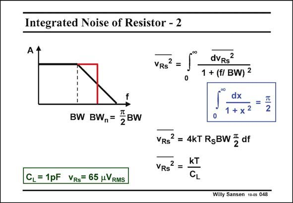

# SANSEN-048 · Integrated Noise of Resistor - 2

章节：04 基本晶体管级的噪声性能  
PDF 页：117；书本页：120；幻灯片编号：048  
状态：unreviewed



## 对应教材讲解

### PDF 117 · 书本 120

Indeed the integral gives p/2 as a value, provided the variables are correct. The integrated noise is now simply 4kTR BW p/2, S which is the noise of the resistor itself, multiplied by BW p/2. This latter bandwidth is called the noise bandwidth BW . n The ratio of the BW to n the BW is 1.57. This extra 57% is required to take into account the integral of the region with the first-order slope of 20 dB/decade. If we took a steeper filter (3rd order or higher), then the BW and the BW nearly coincide. n

### PDF 118 · 书本 121

However, the bandwidth BW also contains R . As a result R is cancelled out in the expression S S of the integrated noise. A very simple result emerges. The integrated noise is simply kT/C . L For 1 pF the integrated noise is 65 mV . For less noise, we have to increase the size of the RMS capacitance. For 10 pF that would be 65/√10 or about 21 mV . RMS This can be understood by realizing that for larger resistors, the noise increases but the bandwidth is reduced by exactly the same amount. Filters all use the integrated noise as a specification or the SNR. They all use large capacitances to increase their SNR, and an amplitude which is as high as possible.

## 公式／性能结论候选摘录

以下为规则截取的原文，尚未逐项判读。

- PDF 117: This latter bandwidth is called the noise bandwidth BW . n The ratio of the BW to n the BW is 1.57.
- PDF 118: However, the bandwidth BW also contains R .
- PDF 118: As a result R is cancelled out in the expression S S of the integrated noise.
- PDF 118: For less noise, we have to increase the size of the RMS capacitance.
- PDF 118: RMS This can be understood by realizing that for larger resistors, the noise increases but the bandwidth is reduced by exactly the same amount.
- PDF 118: They all use large capacitances to increase their SNR, and an amplitude which is as high as possible.

## 曲线结论候选摘录

以下为规则截取的原文，尚未逐项判读。

- PDF 117: This extra 57% is required to take into account the integral of the region with the first-order slope of 20 dB/decade.

## 原文条件与近似候选摘录

以下为规则截取的原文，尚未逐项判读。

- PDF 117: Indeed the integral gives p/2 as a value, provided the variables are correct.

## 幻灯片 OCR（未校正）

```text
Integrated Noise of Resistor - 2
вw Bw,= °вw
CL = 1pF VRS= 65 uVRMS
2
VRS
dVRs?
1 + (f/ BW) 2
dx
1 + x2
VRS
= 4KT RsBW 3 df
VRS
KT
CL
2
Willy Sansen 10-os 048
```

数学上下标、分数及正负号以原图为准。电路图已保留；未核对的连接不输出成可仿真 netlist。
