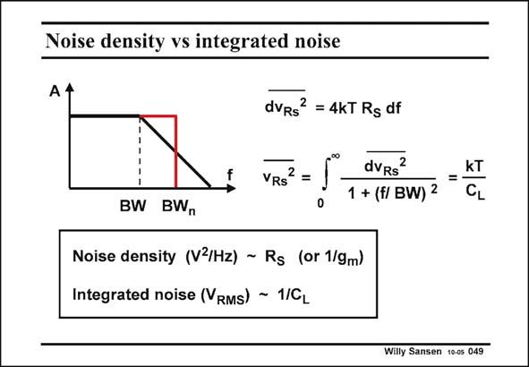

# SANSEN-049 · Noise density vs integrated noise

章节：04 基本晶体管级的噪声性能  
PDF 页：118；书本页：121；幻灯片编号：049  
状态：unreviewed



## 对应教材讲解

### PDF 118 · 书本 121

In this way we reach the important conclusion that noise density depends on the resistor and integrated noise depends on the capacitance. For low noise density we need a small series resistance (or large parallel resistance). For low integrated or total noise, we need a large capacitance to ground. Both obviously depend on absolute temperature. A designer will therefore have to determine whether he deals with a narrow-band system (receivers, bandpass filters, ...) or a wide-band system (switched-capacitor filters, low-pass filters, ...). In a narrow-band system, the narrow band noise (spot noise) is the noise density, multiplied by the bandwidth. The resistances determine the noise performance. In a wide-band system, the kT/C noise is dominant. For low noise, we have to increase the capacitances. Doing this will obviously increase the power consumption. This is a rule of thumb. Low noise requires smaller resistances and or larger capacitances. Both increase the power consumption. Increasing the noise performance inevitably leads to larger power consumption. A low-noise low-power circuit requirement certainly leads to a severe compromise!

## 公式／性能结论候选摘录

以下为规则截取的原文，尚未逐项判读。

- PDF 118: In this way we reach the important conclusion that noise density depends on the resistor and integrated noise depends on the capacitance.
- PDF 118: Both obviously depend on absolute temperature.
- PDF 118: A designer will therefore have to determine whether he deals with a narrow-band system (receivers, bandpass filters, ...) or a wide-band system (switched-capacitor filters, low-pass filters, ...).
- PDF 118: In a narrow-band system, the narrow band noise (spot noise) is the noise density, multiplied by the bandwidth.
- PDF 118: For low noise, we have to increase the capacitances.
- PDF 118: Doing this will obviously increase the power consumption.
- PDF 118: Both increase the power consumption.

## 曲线结论候选摘录

以下为规则截取的原文，尚未逐项判读。

（未由规则找到；不代表原页没有此类内容。）

## 原文条件与近似候选摘录

以下为规则截取的原文，尚未逐项判读。

（未由规则找到；不代表原页没有此类内容。）

## 幻灯片 OCR（未校正）

```text
Noise density vs integrated noise
f
dvRs? = 4kT Rg df
VRS
dvRs
1 + (f/ BW) 2
KT
BW BW,
Noise density (V3/Hz) ~ Rs (or 1/gm)
Integrated noise (VRMs) - 1/CL
Willy Sansen 10-0s 049
```

数学上下标、分数及正负号以原图为准。电路图已保留；未核对的连接不输出成可仿真 netlist。
