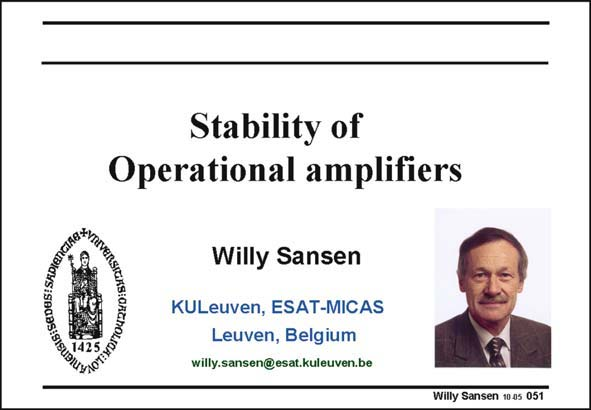

# SANSEN-051 · Slide 051

章节：05 运算放大器的稳定性  
PDF 页：145；书本页：149；幻灯片编号：051  
状态：unreviewed



## 对应教材讲解

### PDF 145 · 书本 149

The operational amplifier (opamp) is certainly the main building block in all of the analog electronics. It is usually implemented in a feedback loop to provide stable and predictable gain and low noise. In this chapter we will review what is required to make sure that this amplifier is stable under all conditions of feedback. An opamp is required not only to be stable but also to provide a well-behaved response. For example, peaking in the frequency domain is normally to be avoided. Also, when a square waveform is applied to an opamp, we don’t want any ringing. All these requirements will impose some fairly precise settings on the positions of the poles and zeros of this amplifier. Adding the requirement that the power consumption be minimized, we will find that it is quite easy to find an optimum in performance, in view of a certain GBW and capacitive load. However, there are many more specifications in an opamp. They will be postponed to the Chapter following this one.

## 公式／性能结论候选摘录

以下为规则截取的原文，尚未逐项判读。

- PDF 145: It is usually implemented in a feedback loop to provide stable and predictable gain and low noise.

## 曲线结论候选摘录

以下为规则截取的原文，尚未逐项判读。

- PDF 145: For example, peaking in the frequency domain is normally to be avoided.

## 原文条件与近似候选摘录

以下为规则截取的原文，尚未逐项判读。

（未由规则找到；不代表原页没有此类内容。）

## 幻灯片 OCR（未校正）

```text
BIE: SEDESISKDIn
Stability of
Operational amplifiers
gtksianaho
Willy Sansen
KULeuven, ESAT-MICAS
Leuven, Belgium
willy.sansen@esat.kuleuven.be
Willy Sansen 10.05 051
```

数学上下标、分数及正负号以原图为准。电路图已保留；未核对的连接不输出成可仿真 netlist。
