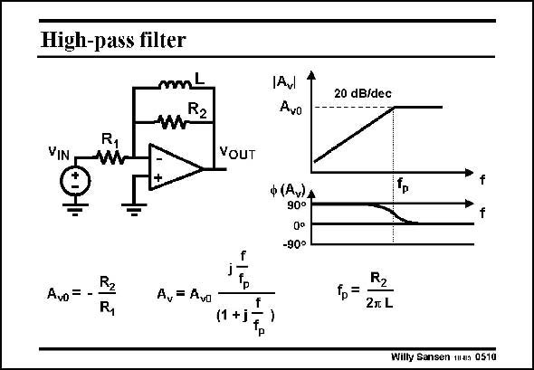

# SANSEN-0510 · High-pass filter

章节：05 运算放大器的稳定性  
PDF 页：149；书本页：153；幻灯片编号：0510  
状态：unreviewed



## 对应教材讲解

### PDF 149 · 书本 153

Inductors can obviously be used as well. Substitution of the capacitor by an inductor provides a high-pass characteristic. At high frequencies, the gain will be reduced by the internal poles of the opamp itself, as we will see later in this Chapter.

## 公式／性能结论候选摘录

以下为规则截取的原文，尚未逐项判读。

- PDF 149: At high frequencies, the gain will be reduced by the internal poles of the opamp itself, as we will see later in this Chapter.

## 曲线结论候选摘录

以下为规则截取的原文，尚未逐项判读。

- PDF 149: Substitution of the capacitor by an inductor provides a high-pass characteristic.

## 原文条件与近似候选摘录

以下为规则截取的原文，尚未逐项判读。

（未由规则找到；不代表原页没有此类内容。）

## 幻灯片 OCR（未校正）

```text
High-pass filter
mnL
VIN
VOUT
Avo = -
A,= Avo
(1 +j
f
Avl
Avo
ф (Av)A
90°
-90°
-
20 dB/dec
R2
fp=
2л L
Willy Sansen man 0510
```

数学上下标、分数及正负号以原图为准。电路图已保留；未核对的连接不输出成可仿真 netlist。
