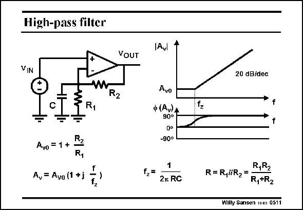

# SANSEN-0511 · High-pass filter

章节：05 运算放大器的稳定性  
PDF 页：150；书本页：154；幻灯片编号：0511  
状态：unreviewed



## 对应教材讲解

### PDF 150 · 书本 154

Another high-pass filter is shown in this slide. It uses a capacitor. The transfer characteristic is very different. At very low frequencies, the gain is constant. It starts increasing at the zero frequency. Note that a first-order increasing characteristic, which is caused by a zero, always shows a slope of 20 dB/decade and a 90° phase shift. Obviously, at high frequencies, the gain will decrease because of the internal poles of the opamp itself.

## 公式／性能结论候选摘录

以下为规则截取的原文，尚未逐项判读。

- PDF 150: At very low frequencies, the gain is constant.
- PDF 150: Obviously, at high frequencies, the gain will decrease because of the internal poles of the opamp itself.

## 曲线结论候选摘录

以下为规则截取的原文，尚未逐项判读。

- PDF 150: The transfer characteristic is very different.
- PDF 150: Note that a first-order increasing characteristic, which is caused by a zero, always shows a slope of 20 dB/decade and a 90° phase shift.

## 原文条件与近似候选摘录

以下为规则截取的原文，尚未逐项判读。

（未由规则找到；不代表原页没有此类内容。）

## 幻灯片 OCR（未校正）

```text
High-pass filter
Avl
VOUT
VIN
R2
R1
Avo
ф (Av)A
90°
-90°
Avo = 1 +
R1
A, = Ava (1 + j
f2=
2л RC
20 dB/dec
fz
R,R2
R=R,l/R2=
R,+R2
Willy Sansen 14a 0511
```

数学上下标、分数及正负号以原图为准。电路图已保留；未核对的连接不输出成可仿真 netlist。
