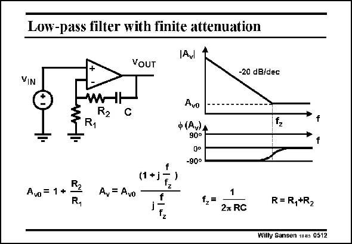
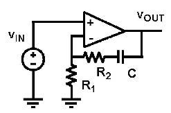
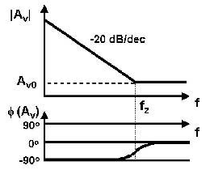

# SANSEN-0512 · 有限阻带衰减的低通滤波器

章节：05 运算放大器的稳定性  
PDF 页：150；书本页：154；幻灯片编号：0512  
状态：representative_case_visually_reviewed



## 对应教材讲解

### PDF 150 · 书本 154

Another filter with a lowpass characteristic is shown in this slide. At high frequencies it now has a constant gain. Since we are dealing with a pole at zero frequency and a zero here, the phase shift is different. Many more filters can be realized by means of opamps. These few examples have been added to illustrate this point. We will now focus on the poles and zeros within the opamp itself.

## 已核对的抽取

非反相运放的反馈支路由 R2 与 C 串联而成；高频增益落到有限平台，低频则呈积分器型态。

- `A_{v0}=1+\frac{R_2}{R_1}` — 本页以 A_v0 标记高频有限增益平台，不是此电路的 DC 增益。
- `A_v=A_{v0}\frac{1+j f/f_z}{j f/f_z}` — 原图转移式，含原点极点与有限频率零点。
- `f_z=\frac{1}{2\pi RC},\quad R=R_1+R_2` — 零点频率。





### 曲线结论

- 幅度在零点前以 −20 dB/decade 下降，之后趋向 A_v0 平台。
- 相位由低频 −90° 趋向高频 0°。

### 条件与近似注记

- 模型判读：图中公式使用理想闭环运放关系，忽略运放自身的有限带宽。
- 此处有原点极点，不能把 A_v0 解读为有限的零频增益。

### 连接关系

- v_in 接运放正输入。
- 负输入经 R1 接地；输出经电容 C 与 R2 串联返回负输入。

## 公式／性能结论候选摘录

以下为规则截取的原文，尚未逐项判读。

- PDF 150: At high frequencies it now has a constant gain.

## 曲线结论候选摘录

以下为规则截取的原文，尚未逐项判读。

- PDF 150: Another filter with a lowpass characteristic is shown in this slide.
- PDF 150: Since we are dealing with a pole at zero frequency and a zero here, the phase shift is different.

## 原文条件与近似候选摘录

以下为规则截取的原文，尚未逐项判读。

（未由规则找到；不代表原页没有此类内容。）

## 幻灯片 OCR（未校正）

```text
Low-pass filter with finite attenuation
Avl
VOUT
-20 dB/dec
VIN
W
R1
C
Avo
ф (Av)A
90°
-90°
f2
Avo = 1 *
A,= Avi
(1 +j*
fz
f
N*
12=
2т RC
R=R,+R2
Willy Sansen m4n 0512
```

数学上下标、分数及正负号以原图为准。电路图已保留；未核对的连接不输出成可仿真 netlist。
