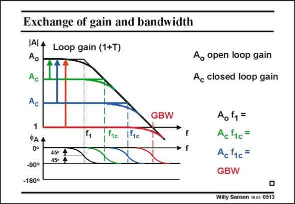
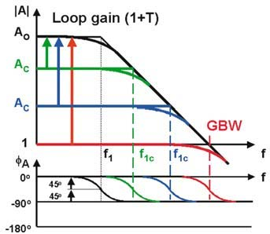

# SANSEN-0513 · 增益与带宽的权衡

章节：05 运算放大器的稳定性  
PDF 页：151；书本页：155；幻灯片编号：0513  
状态：representative_case_visually_reviewed



## 对应教材讲解

### PDF 151 · 书本 155

An opamp always has one internal dominant pole. It occurs at frequency f . It is 1 normally caused by one of the bigger capacitances inside the amplifier. The product of the openloop gain A and this pole o frequency f is the GBW. 1 The GBW is the product of the gain and the bandwidth, for each setting of the gain. Indeed, the ratio of the two resistors, in an inverting amplifier for example, sets the closed-loop gain A . The c corresponding bandwidth is the f . Their product is again the GBW. 1c In the case of a unity-gain buffer, the bandwidth coincides with the GBW, which is the maximum frequency at which this opamp can be used. An opamp allows therefore, an exchange gain for bandwidth. The lower the closed-loop gain, the higher the bandwidth. The product is always the GBW. An opamp is a very versatile building block.

## 已核对的抽取

图中降低闭环增益时，带宽相应增加；教材使用主极点模型说明增益与带宽的交换。

- `A_o f_1=A_c f_{1c}=GBW` — 幻灯片所列增益—带宽积关系；两组闭环设置都画在同一张图中。



### 曲线结论

- 闭环增益越低，图中的对应截止频率越高。
- 正文把单位增益缓冲器的带宽与 GBW 对应。

### 条件与近似注记

- 正文以一个内部主极点说明；图标增益带宽交换不能无条件延伸到多个重要极点或明显峰化的系统。
- 精确闭环因子与高环路增益近似需在后续推导列出。

### 连接关系

- 此页是开环及闭环响应比较图，未重画电路。

## 公式／性能结论候选摘录

以下为规则截取的原文，尚未逐项判读。

- PDF 151: The product of the openloop gain A and this pole o frequency f is the GBW. 1 The GBW is the product of the gain and the bandwidth, for each setting of the gain.
- PDF 151: Indeed, the ratio of the two resistors, in an inverting amplifier for example, sets the closed-loop gain A .
- PDF 151: The c corresponding bandwidth is the f .
- PDF 151: Their product is again the GBW. 1c In the case of a unity-gain buffer, the bandwidth coincides with the GBW, which is the maximum frequency at which this opamp can be used.
- PDF 151: An opamp allows therefore, an exchange gain for bandwidth.
- PDF 151: The lower the closed-loop gain, the higher the bandwidth.

## 曲线结论候选摘录

以下为规则截取的原文，尚未逐项判读。

（未由规则找到；不代表原页没有此类内容。）

## 原文条件与近似候选摘录

以下为规则截取的原文，尚未逐项判读。

（未由规则找到；不代表原页没有此类内容。）

## 幻灯片 OCR（未校正）

```text
Exchange of gain and bandwidth
IAI A
Ao
Ac
Loop gain (1+T)
Ac
1
ФАА
0°
-90°
-180°
450
f1c
1º1c
GBW
Ao open loop gain
Ac closed loop gain
Ao 1=
Ac f1c=
Ac f1c=
GBW
Willy Sansen 10.05 0513
```

数学上下标、分数及正负号以原图为准。电路图已保留；未核对的连接不输出成可仿真 netlist。
