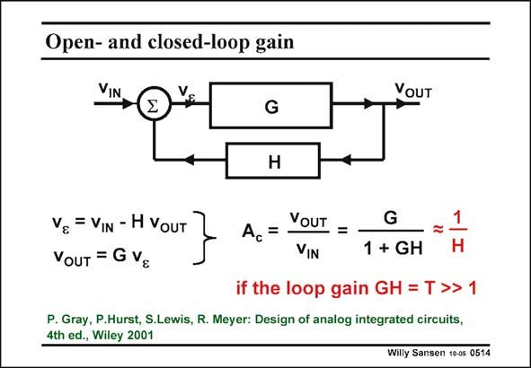
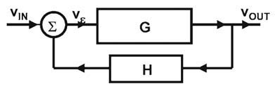

# SANSEN-0514 · 开环与闭环增益

章节：05 运算放大器的稳定性  
PDF 页：151；书本页：155；幻灯片编号：0514  
状态：representative_case_visually_reviewed



## 对应教材讲解

### PDF 151 · 书本 155

Using an opamp with feedback is only a special case of a feedback system. However, in such a system the gain block G has a lot of gain, which is not very precise. The feedback elements, which are resistors and capacitors, determine the closed-loop characteristic. They are very precise. The loop gain is the ratio of the open-loop gain and the closed-loop gain. It is the gain, going around in the loop. It is the quantity that determines all the properties of a feedback system. It is the quantity which indicates how the input and output impedances change. This will be explained in a more rigorous way in Chapter 8.

## 已核对的抽取

负反馈方块图显示误差信号先经前向增益 G，再由 H 返回输入相减；当环路增益很大，闭环增益近似由 H 决定。

- `v_\varepsilon=v_{IN}-H v_{OUT}` — 加总节点采负反馈。
- `v_{OUT}=G v_\varepsilon` — 前向增益方块关系。
- `A_c=\frac{v_{OUT}}{v_{IN}}=\frac{G}{1+GH}\approx\frac{1}{H}` — 前式是此线性方块模型的关系，最后一步为近似。
- `T=GH\gg 1` — 幻灯片明列的近似条件。



### 曲线结论

- 本页为反馈方块图，没有波特曲线。

### 条件与近似注记

- 原文明列 GH=T≫1，才使用 A_c≈1/H。
- 一致性核对：正文将环路增益说成开／闭环增益之比，属简化说法；依本页公式该比值是 1+GH，与 GH 只在大环路增益时近似相等。
- 适合后续 SFG 分析，但本步只抽取原有方块关系。

### 连接关系

- v_IN 与 −H·v_OUT 在加总节点生成 v_epsilon。
- G 将 v_epsilon 映射到 v_OUT；H 从 v_OUT 回到加总节点的负端。

## 公式／性能结论候选摘录

以下为规则截取的原文，尚未逐项判读。

- PDF 151: However, in such a system the gain block G has a lot of gain, which is not very precise.
- PDF 151: The loop gain is the ratio of the open-loop gain and the closed-loop gain.
- PDF 151: It is the gain, going around in the loop.

## 曲线结论候选摘录

以下为规则截取的原文，尚未逐项判读。

- PDF 151: The feedback elements, which are resistors and capacitors, determine the closed-loop characteristic.

## 原文条件与近似候选摘录

以下为规则截取的原文，尚未逐项判读。

（未由规则找到；不代表原页没有此类内容。）

## 幻灯片 OCR（未校正）

```text
Open- and closed-loop gain
VIN
V.
VOUT
G
H
Vg = VIN - H VouT
YOUT = G Vg
Ac =
VOUT =
VIN
G
1 + GH
if the loop gain GH = T >> 1
P. Gray, P.Hurst, S.Lewis, R. Meyer: Design of analog integrated circuits,
4th ed., Wiley 2001
Willy Sansen 10-05 0514
```

数学上下标、分数及正负号以原图为准。电路图已保留；未核对的连接不输出成可仿真 netlist。
