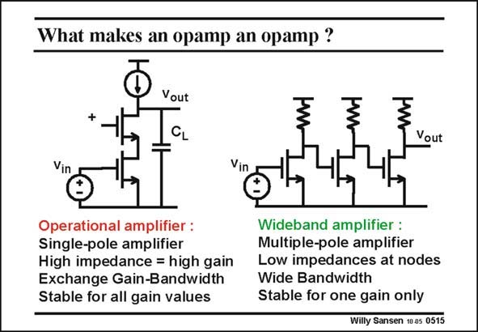

# SANSEN-0515 · What makes an opamp an opamp ?

章节：05 运算放大器的稳定性  
PDF 页：152；书本页：156；幻灯片编号：0515  
状态：unreviewed



## 对应教材讲解

### PDF 152 · 书本 156

An opamp is really a singlepole system. As a result, it allows exchange of gain with bandwidth, within a specific GBW. Because there is only one dominant pole, there can be only one internal node at high impedance. If there are more nodes at high impedance, then we have more poles. In this case we have to add capacitance or increase the currents, such that this second pole, the nondominant pole, is at sufficiently high frequencies, beyond the GBW. All two-stage amplifiers have two high-impedance nodes and hence two poles. Therefore, all amplifiers with two high-impedance nodes are called two-stage amplifiers, irrespective of the number of transistors. We will have to compensate these two-stage amplifiers, i.e. we will have to add capacitance or increase currents to shift the non-dominant pole out to sufficiently high frequencies. As a result, the amplifier resembles again a single-pole system. Wideband amplifiers are very different. They consist of more stages, each of them having a pole. They are normally compensated at one particular setting of the gain. They are not meant to exchange gain for bandwidth. On the contrary, at that gain setting, they are optimized for maximum bandwidth. More about such amplifiers is given in Chapter 8.

## 公式／性能结论候选摘录

以下为规则截取的原文，尚未逐项判读。

- PDF 152: As a result, it allows exchange of gain with bandwidth, within a specific GBW.
- PDF 152: In this case we have to add capacitance or increase the currents, such that this second pole, the nondominant pole, is at sufficiently high frequencies, beyond the GBW.
- PDF 152: Therefore, all amplifiers with two high-impedance nodes are called two-stage amplifiers, irrespective of the number of transistors.
- PDF 152: We will have to compensate these two-stage amplifiers, i.e. we will have to add capacitance or increase currents to shift the non-dominant pole out to sufficiently high frequencies.
- PDF 152: As a result, the amplifier resembles again a single-pole system.
- PDF 152: They are normally compensated at one particular setting of the gain.
- PDF 152: They are not meant to exchange gain for bandwidth.
- PDF 152: On the contrary, at that gain setting, they are optimized for maximum bandwidth.

## 曲线结论候选摘录

以下为规则截取的原文，尚未逐项判读。

（未由规则找到；不代表原页没有此类内容。）

## 原文条件与近似候选摘录

以下为规则截取的原文，尚未逐项判读。

（未由规则找到；不代表原页没有此类内容。）

## 幻灯片 OCR（未校正）

```text
What makes an opamp an opamp ?
+
Vout
CL
Vout
Vin
Vin
Operational amplifier :
Single-pole amplifier
High impedance = high gain
Exchange Gain-Bandwidth
Stable for all gain values
Wideband amplifier :
Multiple-pole amplifier
Low impedances at nodes
Wide Bandwidth
Stable for one gain only
Willy Sansen 10 as 0515
```

数学上下标、分数及正负号以原图为准。电路图已保留；未核对的连接不输出成可仿真 netlist。
