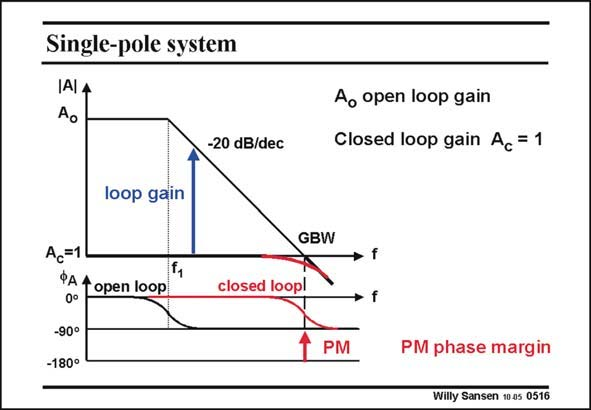

# SANSEN-0516 · Single-pole system

章节：05 运算放大器的稳定性  
PDF 页：152；书本页：156；幻灯片编号：0516  
状态：unreviewed



## 对应教材讲解

### PDF 152 · 书本 156

If the operational amplifier is truly a single-pole amplifier, then it can never show peaking or any other form of instability. Indeed the slope of −20 dB/decade is then maintained to frequencies beyond its GBW. Also, its phase of −90° is constant for all frequencies beyond the bandwidth f . 1 Application of unity-gain feedback results in an amplifier, the bandwidth of which coincides with the GBW. There is no trace of peaking.

### PDF 153 · 书本 157

Peaking or onset of oscillation would only be possible if the phase characteristic approached the −180° line. In this case the negative feedback would be converted into positive feedback and oscillation would be possible. We will have to verify how far away the phase is from that critical −180°. This is why this phase distance has received a name. It is called phase margin. It is taken at the frequency where the loop gain is unity. In this case this frequency is the GBW. Clearly, a phase margin of 90° is large enough not to find peaking, or any form of oscillation.

## 公式／性能结论候选摘录

以下为规则截取的原文，尚未逐项判读。

- PDF 152: Also, its phase of −90° is constant for all frequencies beyond the bandwidth f . 1 Application of unity-gain feedback results in an amplifier, the bandwidth of which coincides with the GBW.
- PDF 153: It is taken at the frequency where the loop gain is unity.

## 曲线结论候选摘录

以下为规则截取的原文，尚未逐项判读。

- PDF 152: If the operational amplifier is truly a single-pole amplifier, then it can never show peaking or any other form of instability.
- PDF 152: Indeed the slope of −20 dB/decade is then maintained to frequencies beyond its GBW.
- PDF 152: Also, its phase of −90° is constant for all frequencies beyond the bandwidth f . 1 Application of unity-gain feedback results in an amplifier, the bandwidth of which coincides with the GBW.
- PDF 152: There is no trace of peaking.
- PDF 153: Peaking or onset of oscillation would only be possible if the phase characteristic approached the −180° line.
- PDF 153: We will have to verify how far away the phase is from that critical −180°.
- PDF 153: This is why this phase distance has received a name.
- PDF 153: It is called phase margin.

## 原文条件与近似候选摘录

以下为规则截取的原文，尚未逐项判读。

（未由规则找到；不代表原页没有此类内容。）

## 幻灯片 OCR（未校正）

```text
Single-pole system
IAlA
-20 dB/dec
Ao open loop gain
Closed loop gain Ac = 1
loop gain
GBW
Ac=1
PA t open loop
0°
-90°
-180°
closed loopl
» f
• f
PM
PM phase margin
Willy Sansen 10 os 0516
```

数学上下标、分数及正负号以原图为准。电路图已保留；未核对的连接不输出成可仿真 netlist。
