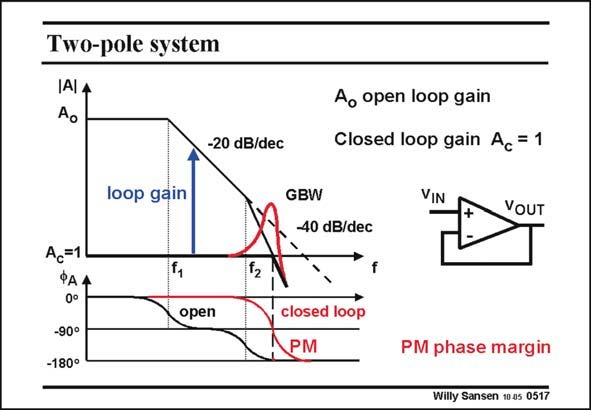

# SANSEN-0517 · Two-pole system

章节：05 运算放大器的稳定性  
PDF 页：153；书本页：157；幻灯片编号：0517  
状态：unreviewed



## 对应教材讲解

### PDF 153 · 书本 157

This is very different for an opamp with two poles at frequencies f and f . 1 2 Each pole causes a phase shift of −90°. As a result, we find a phase shift at high frequencies. This means that at high frequencies, the signal is inverted. There is still a loop gain slightly larger than unity. Negative feedback turns into positive feedback with a little bit of gain. We obtain therefore, an oscillator rather than an amplifier! At the frequency where the loop gain becomes unity (which here is the GBW), the phase margin PM is not quite zero. If it were zero we would have a real oscillator. It is not quite zero but very small. This is why this amplifier shows a tendency for oscillation. It shows a large amount of peaking at that frequency. We do not want peaking because such a peak is very irreproducible. Moreover the noise is deteriorated by that peak. Remember, noise has to be looked at on a linear frequency axis. Such a peak then extends over most of the frequency range. The question is, how far do we have to stay with our phase characteristic from this critical −180°; how large can the phase margin PM be allowed to increase to avoid this peaking?

## 公式／性能结论候选摘录

以下为规则截取的原文，尚未逐项判读。

- PDF 153: As a result, we find a phase shift at high frequencies.
- PDF 153: There is still a loop gain slightly larger than unity.
- PDF 153: Negative feedback turns into positive feedback with a little bit of gain.
- PDF 153: We obtain therefore, an oscillator rather than an amplifier!
- PDF 153: At the frequency where the loop gain becomes unity (which here is the GBW), the phase margin PM is not quite zero.
- PDF 153: The question is, how far do we have to stay with our phase characteristic from this critical −180°; how large can the phase margin PM be allowed to increase to avoid this peaking?

## 曲线结论候选摘录

以下为规则截取的原文，尚未逐项判读。

- PDF 153: This is very different for an opamp with two poles at frequencies f and f . 1 2 Each pole causes a phase shift of −90°.
- PDF 153: As a result, we find a phase shift at high frequencies.
- PDF 153: At the frequency where the loop gain becomes unity (which here is the GBW), the phase margin PM is not quite zero.
- PDF 153: It shows a large amount of peaking at that frequency.
- PDF 153: We do not want peaking because such a peak is very irreproducible.
- PDF 153: Moreover the noise is deteriorated by that peak.
- PDF 153: Remember, noise has to be looked at on a linear frequency axis.
- PDF 153: Such a peak then extends over most of the frequency range.

## 原文条件与近似候选摘录

以下为规则截取的原文，尚未逐项判读。

（未由规则找到；不代表原页没有此类内容。）

## 幻灯片 OCR（未校正）

```text
Two-pole system
IAI A
Ao
-20 dB/dec
loop gain
GBW
Ao open loop gain
Closed loop gain Ac = 1
VIN
VOUT
40 dB/dec
Ac=1
ФАА
0°
-90°
-180°
open
closed loop
PM
PM phase margin
Willy Sansen 10 as 0517
```

数学上下标、分数及正负号以原图为准。电路图已保留；未核对的连接不输出成可仿真 netlist。
