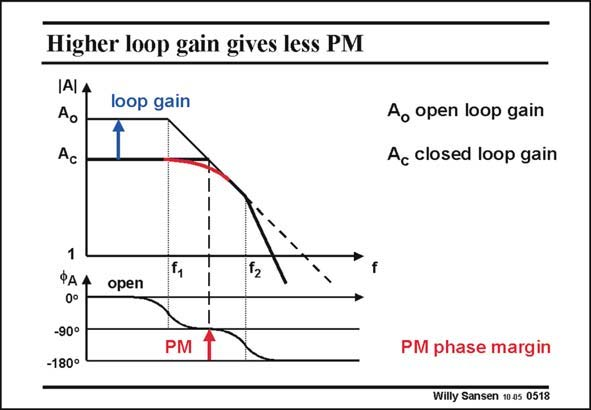

# SANSEN-0518 · Higher loop gain gives less PM

章节：05 运算放大器的稳定性  
PDF 页：154；书本页：158；幻灯片编号：0518  
状态：unreviewed



## 对应教材讲解

### PDF 154 · 书本 158

Nevertheless, the same amplifier, with two poles, can be used without peaking. It is sufficient to use it at a higher closed-loop gain A . c The closed-loop gain is quite high now. As a result, the loop gain is much smaller. Moreover, when we check where the loop gain becomes unity, we find a frequency at which the phase margin PM is quite high. This is why there is no peaking. The amplitude curve is quite nicely rounded. It is clear that the same amplifier can show peaking or not, depending on the actual closedloop gain A . It is also clear that for unity-gain feedback, the frequency where we have to check c the phase margin is the highest. The phase margin is the smallest at the highest frequency. Unitygain amplifiers give the highest amount of peaking!

## 公式／性能结论候选摘录

以下为规则截取的原文，尚未逐项判读。

- PDF 154: It is sufficient to use it at a higher closed-loop gain A . c The closed-loop gain is quite high now.
- PDF 154: As a result, the loop gain is much smaller.
- PDF 154: Moreover, when we check where the loop gain becomes unity, we find a frequency at which the phase margin PM is quite high.
- PDF 154: It is clear that the same amplifier can show peaking or not, depending on the actual closedloop gain A .
- PDF 154: It is also clear that for unity-gain feedback, the frequency where we have to check c the phase margin is the highest.

## 曲线结论候选摘录

以下为规则截取的原文，尚未逐项判读。

- PDF 154: Nevertheless, the same amplifier, with two poles, can be used without peaking.
- PDF 154: Moreover, when we check where the loop gain becomes unity, we find a frequency at which the phase margin PM is quite high.
- PDF 154: This is why there is no peaking.
- PDF 154: The amplitude curve is quite nicely rounded.
- PDF 154: It is clear that the same amplifier can show peaking or not, depending on the actual closedloop gain A .
- PDF 154: It is also clear that for unity-gain feedback, the frequency where we have to check c the phase margin is the highest.
- PDF 154: The phase margin is the smallest at the highest frequency.
- PDF 154: Unitygain amplifiers give the highest amount of peaking!

## 原文条件与近似候选摘录

以下为规则截取的原文，尚未逐项判读。

- PDF 154: As a result, the loop gain is much smaller.

## 幻灯片 OCR（未校正）

```text
Higher loop gain gives less PM
IAI 4
loop gain
Ao
Ac
Ao open loop gain
Ac closed loop gain
1
ФА4
0°
-90°
-180°
open
PM
PM phase margin
Willy Sansen 10 0s 0518
```

数学上下标、分数及正负号以原图为准。电路图已保留；未核对的连接不输出成可仿真 netlist。
