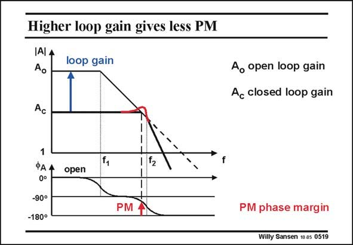

# SANSEN-0519 · Higher loop gain gives less PM

章节：05 运算放大器的稳定性  
PDF 页：154；书本页：158；幻灯片编号：0519  
状态：unreviewed



## 对应教材讲解

### PDF 154 · 书本 158

Let us now gradually lower the closed loop gain A . c The loop gain increases, and the frequency at which we have to read the phase margin increases. The phase margin thus decreases and the peaking is gradually showing up!

## 公式／性能结论候选摘录

以下为规则截取的原文，尚未逐项判读。

- PDF 154: Let us now gradually lower the closed loop gain A . c The loop gain increases, and the frequency at which we have to read the phase margin increases.
- PDF 154: The phase margin thus decreases and the peaking is gradually showing up!

## 曲线结论候选摘录

以下为规则截取的原文，尚未逐项判读。

- PDF 154: Let us now gradually lower the closed loop gain A . c The loop gain increases, and the frequency at which we have to read the phase margin increases.
- PDF 154: The phase margin thus decreases and the peaking is gradually showing up!

## 原文条件与近似候选摘录

以下为规则截取的原文，尚未逐项判读。

（未由规则找到；不代表原页没有此类内容。）

## 幻灯片 OCR（未校正）

```text
Higher loop gain gives less PM
IAlA
Ao
loop gain
Ao open loop gain
Ac closed loop gain
Ac
1
ФАА
0°
-90°
-180°
f,
112
open
PM
PM phase margin
Willy Sansen 10 as 0519
```

数学上下标、分数及正负号以原图为准。电路图已保留；未核对的连接不输出成可仿真 netlist。
