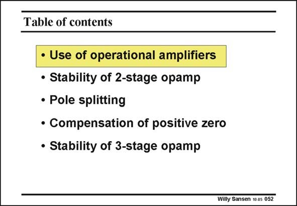

# SANSEN-052 · Table of contents

章节：05 运算放大器的稳定性  
PDF 页：145；书本页：149；幻灯片编号：052  
状态：unreviewed



## 对应教材讲解

### PDF 145 · 书本 149

First of all, we have to review some of the terminology of an operational amplifier, such as open-and closed-loop gain. Also, we want to review some basics of second-order systems. These are the first two Sections. We put emphasis on two-stage amplifiers. We have dealt with single-transistor stages already in Chapter 2. We will focus especially on that positive zero which shows up in any two-stage opamp. They can be avoided by means of additional current consumption. It is much more elegant however, to use some circuit tricks which allow the reduction of the total biasing current. Finally, we will extended the compensation techniques, adopted for a two-stage amplifier, to three-stage amplifiers. Many class-AB amplifiers have three stages. Moreover, three stages become a necessity once the gain per stages has gone down to real low values, as in nanometer CMOS.

## 公式／性能结论候选摘录

以下为规则截取的原文，尚未逐项判读。

- PDF 145: First of all, we have to review some of the terminology of an operational amplifier, such as open-and closed-loop gain.
- PDF 145: Moreover, three stages become a necessity once the gain per stages has gone down to real low values, as in nanometer CMOS.

## 曲线结论候选摘录

以下为规则截取的原文，尚未逐项判读。

（未由规则找到；不代表原页没有此类内容。）

## 原文条件与近似候选摘录

以下为规则截取的原文，尚未逐项判读。

（未由规则找到；不代表原页没有此类内容。）

## 幻灯片 OCR（未校正）

```text
Table of contents
• Use of operational amplifiers
• Stability of 2-stage opamp
• Pole splitting
• Compensation of positive zero
• Stability of 3-stage opamp
Willy Sansen 10 os 052
```

数学上下标、分数及正负号以原图为准。电路图已保留；未核对的连接不输出成可仿真 netlist。
