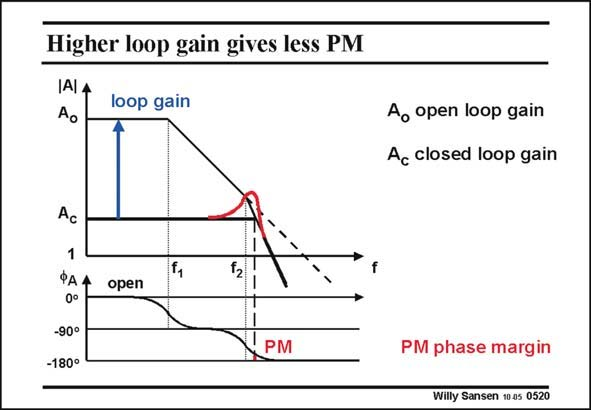

# SANSEN-0520 · Higher loop gain gives less PM

章节：05 运算放大器的稳定性  
PDF 页：155；书本页：159；幻灯片编号：0520  
状态：unreviewed



## 对应教材讲解

### PDF 155 · 书本 159

For even lower closed-loop gain A , the loop gain c increases further, and the frequency at which we have to read the phase margin increases even more. The phase margin thus decreases further and the peaking therefore becomes more severe!

## 公式／性能结论候选摘录

以下为规则截取的原文，尚未逐项判读。

- PDF 155: For even lower closed-loop gain A , the loop gain c increases further, and the frequency at which we have to read the phase margin increases even more.
- PDF 155: The phase margin thus decreases further and the peaking therefore becomes more severe!

## 曲线结论候选摘录

以下为规则截取的原文，尚未逐项判读。

- PDF 155: For even lower closed-loop gain A , the loop gain c increases further, and the frequency at which we have to read the phase margin increases even more.
- PDF 155: The phase margin thus decreases further and the peaking therefore becomes more severe!

## 原文条件与近似候选摘录

以下为规则截取的原文，尚未逐项判读。

（未由规则找到；不代表原页没有此类内容。）

## 幻灯片 OCR（未校正）

```text
Higher loop gain gives less PM
IAlA
loop gain
Ao open loop gain
Ac closed loop gain
Ac
1
ФАА
0°
-90°
-180°
open
PM
PM phase margin
Willy Sansen 10 as 0520
```

数学上下标、分数及正负号以原图为准。电路图已保留；未核对的连接不输出成可仿真 netlist。
