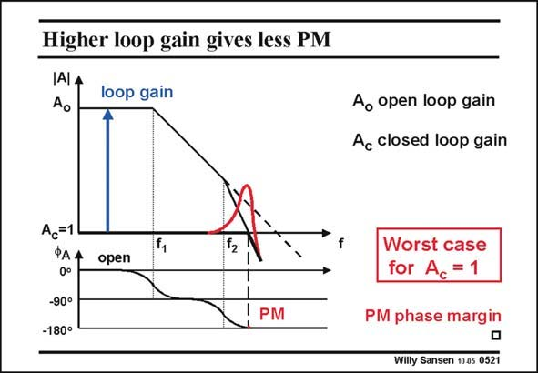

# SANSEN-0521 · Higher loop gain gives less PM

章节：05 运算放大器的稳定性  
PDF 页：155；书本页：159；幻灯片编号：0521  
状态：unreviewed



## 对应教材讲解

### PDF 155 · 书本 159

Finally, we have again reached the point of unitygain closed-loop gain A . c The loop gain is the same as the open-loop gain. The frequency at which we have to read the phase margin is now the GBW. The phase margin has become very small and the peaking is most severe! It is clear that the worst peaking has been obtained for the largest loop gain, i.e. for the lost closed-loop gain or for unity gain. This is clearly the worst case. We will try to avoid this peaking by adding a compensation capacitance or by increasing the currents. It is clear that an amplifier which has been compensated at unity gain, is overcompensated at most other settings of closed-loop gain.

## 公式／性能结论候选摘录

以下为规则截取的原文，尚未逐项判读。

- PDF 155: Finally, we have again reached the point of unitygain closed-loop gain A . c The loop gain is the same as the open-loop gain.
- PDF 155: It is clear that the worst peaking has been obtained for the largest loop gain, i.e. for the lost closed-loop gain or for unity gain.
- PDF 155: It is clear that an amplifier which has been compensated at unity gain, is overcompensated at most other settings of closed-loop gain.

## 曲线结论候选摘录

以下为规则截取的原文，尚未逐项判读。

- PDF 155: The frequency at which we have to read the phase margin is now the GBW.
- PDF 155: The phase margin has become very small and the peaking is most severe!
- PDF 155: It is clear that the worst peaking has been obtained for the largest loop gain, i.e. for the lost closed-loop gain or for unity gain.
- PDF 155: We will try to avoid this peaking by adding a compensation capacitance or by increasing the currents.

## 原文条件与近似候选摘录

以下为规则截取的原文，尚未逐项判读。

（未由规则找到；不代表原页没有此类内容。）

## 幻灯片 OCR（未校正）

```text
Higher loop gain gives less PM
IAI A
Ao
loop gain
Ao open loop gain
Ac closed loop gain
Ac=1
ФАА
0°
-90°
-180°
112
open
PM
Worst case
for Ac = 1
PM phase margin
Willy Sansen 10.05 0521
```

数学上下标、分数及正负号以原图为准。电路图已保留；未核对的连接不输出成可仿真 netlist。
