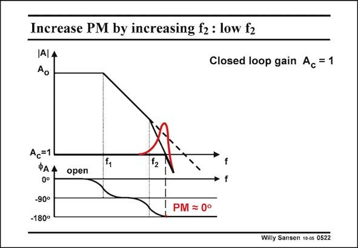

# SANSEN-0522 · Increase PM by increasing f2: low f2

章节：05 运算放大器的稳定性  
PDF 页：156；书本页：160；幻灯片编号：0522  
状态：unreviewed



## 对应教材讲解

### PDF 156 · 书本 160

How can we compensate a two-pole amplifier? The objective is quite straightforward. We have to find a means to shift the second or non-dominant pole f to higher frequencies. 2 The extra −90° attributed to this pole has now disappeared. The phase margin is now 90°. To illustrate the effect of shifting the non-dominant pole to higher frequencies, we repeat the Bode diagrams for the same two-pole amplifier and the same unity-gain, but with three different positions of the nondominant pole f . 2 In the Bode diagrams shown in this slide, the second pole f is clearly too close to the first 2 one f . Large peaking results. 1

## 公式／性能结论候选摘录

以下为规则截取的原文，尚未逐项判读。

- PDF 156: To illustrate the effect of shifting the non-dominant pole to higher frequencies, we repeat the Bode diagrams for the same two-pole amplifier and the same unity-gain, but with three different positions of the nondominant pole f . 2 In the Bode diagrams shown in this slide, the second pole f is clearly too close to the first 2 one f .

## 曲线结论候选摘录

以下为规则截取的原文，尚未逐项判读。

- PDF 156: The phase margin is now 90°.
- PDF 156: To illustrate the effect of shifting the non-dominant pole to higher frequencies, we repeat the Bode diagrams for the same two-pole amplifier and the same unity-gain, but with three different positions of the nondominant pole f . 2 In the Bode diagrams shown in this slide, the second pole f is clearly too close to the first 2 one f .
- PDF 156: Large peaking results. 1

## 原文条件与近似候选摘录

以下为规则截取的原文，尚未逐项判读。

（未由规则找到；不代表原页没有此类内容。）

## 幻灯片 OCR（未校正）

```text
Increase PM by increasing f2: low f2
IAIA
Closed loop gain Ac = 1
Ac=1
ФАА
0°
-90°
-180°
f2
open
f
PM = 0°
Willy Sansen 10-05 0522
```

数学上下标、分数及正负号以原图为准。电路图已保留；未核对的连接不输出成可仿真 netlist。
