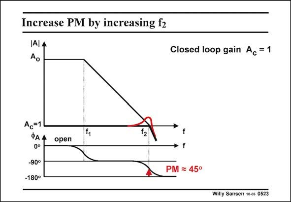

# SANSEN-0523 · Increase PM by increasing f2

章节：05 运算放大器的稳定性  
PDF 页：156；书本页：160；幻灯片编号：0523  
状态：unreviewed



## 对应教材讲解

### PDF 156 · 书本 160

Shifting the second pole to higher frequencies increases the phase margin and decreases the peaking. In this case the non-dominant pole f coincides with 2 the GBW. As a result the phase margin is 45°. The peaking is smaller indeed.

## 公式／性能结论候选摘录

以下为规则截取的原文，尚未逐项判读。

- PDF 156: Shifting the second pole to higher frequencies increases the phase margin and decreases the peaking.
- PDF 156: As a result the phase margin is 45°.

## 曲线结论候选摘录

以下为规则截取的原文，尚未逐项判读。

- PDF 156: Shifting the second pole to higher frequencies increases the phase margin and decreases the peaking.
- PDF 156: As a result the phase margin is 45°.
- PDF 156: The peaking is smaller indeed.

## 原文条件与近似候选摘录

以下为规则截取的原文，尚未逐项判读。

（未由规则找到；不代表原页没有此类内容。）

## 幻灯片 OCR（未校正）

```text
Increase PM by increasing f2
Closed loop gain Ac = 1
Ac=1
ФАА
0°
-90°
-180°
open
f
• f
PM ≥ 45°
Willy Sansen 10-05 0523
```

数学上下标、分数及正负号以原图为准。电路图已保留；未核对的连接不输出成可仿真 netlist。
