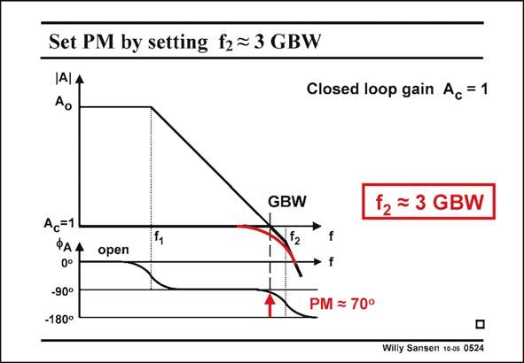

# SANSEN-0524 · Set PM by setting f2= 3 GBW

章节：05 运算放大器的稳定性  
PDF 页：157；书本页：161；幻灯片编号：0524  
状态：unreviewed



## 对应教材讲解

### PDF 157 · 书本 161

Finally, we have shifted the non-dominant pole f to a 2 value which is about three times the GBW. In this case the phase margin is close to 70°. The peaking is gone altogether. The amplitude curve is nicely rounded. This is what we want to design all our opamps for, a phase margin of around 70°, such that no peaking occurs. Where is this factor of three coming from?

## 公式／性能结论候选摘录

以下为规则截取的原文，尚未逐项判读。

（未由规则找到；不代表原页没有此类内容。）

## 曲线结论候选摘录

以下为规则截取的原文，尚未逐项判读。

- PDF 157: In this case the phase margin is close to 70°.
- PDF 157: The peaking is gone altogether.
- PDF 157: The amplitude curve is nicely rounded.
- PDF 157: This is what we want to design all our opamps for, a phase margin of around 70°, such that no peaking occurs.

## 原文条件与近似候选摘录

以下为规则截取的原文，尚未逐项判读。

（未由规则找到；不代表原页没有此类内容。）

## 幻灯片 OCR（未校正）

```text
Set PM by setting f2= 3 GBW
IAIA
Ao
Closed loop gain Ac = 1
GBW
12 = 3 GBW
Ac=1
ФАА
0°
-90°
-180°
open
f
f
PM = 70°
Willy Sansen 10-05 0524
```

数学上下标、分数及正负号以原图为准。电路图已保留；未核对的连接不输出成可仿真 netlist。
