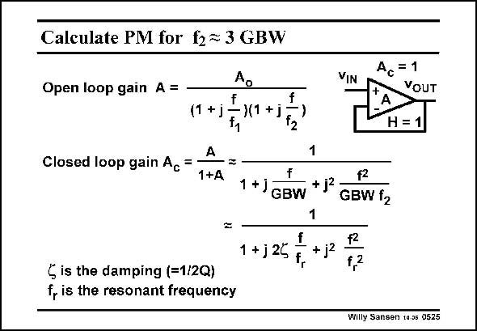

# SANSEN-0525 · Calculate PM for f2 = 3 GBW

章节：05 运算放大器的稳定性  
PDF 页：157；书本页：161；幻灯片编号：0525  
状态：unreviewed



## 对应教材讲解

### PDF 157 · 书本 161

This factor of three is actually a result of a calculation of the peaking and phase margin, of a two-pole system to which unity-gain feedback is applied. This is explained in all textbooks on feedback or control theory! When we take the expression of amplifier A with lowfrequency gain A and two 0 poles, we have to plug it in the feedback expression for unity gain. Actually, this feedback expression was G/(1+GH) but here H=1 and G=A. The closed-loop gain A is unity at low frequencies. c In this feedback expression, we can rewrite the coefficients in terms of resonant frequency f r and damping f (Greek letter d, zeta). Often parameter Q is used instead of f, then Q=1/2 f. It is clear that f gives the frequency at which peaking or resonance occurs. Parameter f r determines how high the peaking is. For zero f, the term in s vanishes and we obtain a zero denominator at frequency f . Therefore, we obtain an oscillator at frequency f . r r We will need values of f between 0.5 and 1 to avoid peaking. Actually when f=1, we have one double pole.

## 公式／性能结论候选摘录

以下为规则截取的原文，尚未逐项判读。

- PDF 157: This factor of three is actually a result of a calculation of the peaking and phase margin, of a two-pole system to which unity-gain feedback is applied.
- PDF 157: When we take the expression of amplifier A with lowfrequency gain A and two 0 poles, we have to plug it in the feedback expression for unity gain.
- PDF 157: The closed-loop gain A is unity at low frequencies. c In this feedback expression, we can rewrite the coefficients in terms of resonant frequency f r and damping f (Greek letter d, zeta).
- PDF 157: Therefore, we obtain an oscillator at frequency f . r r We will need values of f between 0.5 and 1 to avoid peaking.

## 曲线结论候选摘录

以下为规则截取的原文，尚未逐项判读。

- PDF 157: This factor of three is actually a result of a calculation of the peaking and phase margin, of a two-pole system to which unity-gain feedback is applied.
- PDF 157: It is clear that f gives the frequency at which peaking or resonance occurs.
- PDF 157: Parameter f r determines how high the peaking is.
- PDF 157: Therefore, we obtain an oscillator at frequency f . r r We will need values of f between 0.5 and 1 to avoid peaking.

## 原文条件与近似候选摘录

以下为规则截取的原文，尚未逐项判读。

（未由规则找到；不代表原页没有此类内容。）

## 幻灯片 OCR（未校正）

```text
Calculate PM for f2 = 3 GBW
Open loop gain A =
Ao
f
)(1 +j
f
f2
VIN
A, = 1
VOUT
H = 1
Closed loop gain Ac
(1 +j
A
1+A
f2
1 +J GBW
+jª
GBW f2
+2
1 + j 25
+ j2
§ is the damping (=1/2Q)
f, is the resonant frequency
Willy Sansen 10 05 0525
```

数学上下标、分数及正负号以原图为准。电路图已保留；未核对的连接不输出成可仿真 netlist。
