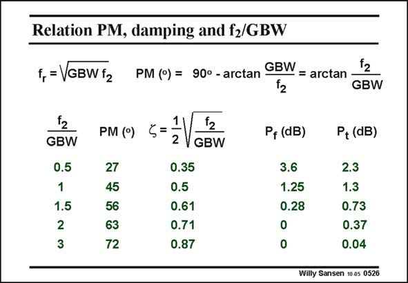

# SANSEN-0526 · Relation PM, damping and fz/GBW

章节：05 运算放大器的稳定性  
PDF 页：158；书本页：162；幻灯片编号：0526  
状态：unreviewed



## 对应教材讲解

### PDF 158 · 书本 162

The actual values of the phase margin and peaking are now easily calculated. They are given in this slide. Also, the amount of peaking in the frequency domain P f is given, followed by the amount of peaking in the time domain P . t For a ratio of three between the non-dominant pole and the GBW, the phase margin is 72°. The corresponding f is 0.87 (or Q=0.57). No peaking occurs in the Bode diagram. We could be allowed to reduce the non-dominant pole a bit, to two times the GBW. The phase margin decreases to 63°, decreasing the f as well to 0.71 (and Q=0.71) and we still do not have peaking. We cannot forget, however, that we are using hand calculations here. After this part of the design procedure, we want to verify the circuit performance by means of a numerical simulator such as SPICE, Then all parasitic capacitances come in, pushing the non-dominant pole to lower values and decreasing the phase margin. A value of three is thus a good safety position to start with.

## 公式／性能结论候选摘录

以下为规则截取的原文，尚未逐项判读。

- PDF 158: The phase margin decreases to 63°, decreasing the f as well to 0.71 (and Q=0.71) and we still do not have peaking.
- PDF 158: A value of three is thus a good safety position to start with.

## 曲线结论候选摘录

以下为规则截取的原文，尚未逐项判读。

- PDF 158: The actual values of the phase margin and peaking are now easily calculated.
- PDF 158: Also, the amount of peaking in the frequency domain P f is given, followed by the amount of peaking in the time domain P . t For a ratio of three between the non-dominant pole and the GBW, the phase margin is 72°.
- PDF 158: No peaking occurs in the Bode diagram.
- PDF 158: The phase margin decreases to 63°, decreasing the f as well to 0.71 (and Q=0.71) and we still do not have peaking.
- PDF 158: After this part of the design procedure, we want to verify the circuit performance by means of a numerical simulator such as SPICE, Then all parasitic capacitances come in, pushing the non-dominant pole to lower values and decreasing the phase margin.

## 原文条件与近似候选摘录

以下为规则截取的原文，尚未逐项判读。

（未由规则找到；不代表原页没有此类内容。）

## 幻灯片 OCR（未校正）

```text
Relation PM, damping and fz/GBW
f, = VGBW f2
PM (°) = 900 - arctan GBW
= arctan
GBW
GBW
0.5
1
1.5
2
3
PM (°)
27
45
56
63
72
1V12
2 V
GBW
0.35
0.5
0.61
0.71
0.87
Pf (dB)
3.6
1.25
0.28
0
0
P, (dB)
2.3
1.3
0.73
0.37
0.04
Willy Sansen 10 as 0526
```

数学上下标、分数及正负号以原图为准。电路图已保留；未核对的连接不输出成可仿真 netlist。
