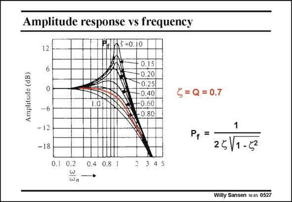

# SANSEN-0527 · Amplitude response vs frequency

章节：05 运算放大器的稳定性  
PDF 页：158；书本页：162；幻灯片编号：0527  
状态：unreviewed



## 对应教材讲解

### PDF 158 · 书本 162

A better sketch of the peaking in the frequency domain (or in the Bode diagram) is shown in this slide. The value of the maximum peaking P is given as f well. It is clear that for a damping f of 0.7, we obtain a maximally-flat response. Going to larger f reduces the bandwidth too much. Also, going to smaller values of f causes peaking indeed. For zero f, we would have a peak to infinity, which is typical for an oscillator.

## 公式／性能结论候选摘录

以下为规则截取的原文，尚未逐项判读。

- PDF 158: Going to larger f reduces the bandwidth too much.

## 曲线结论候选摘录

以下为规则截取的原文，尚未逐项判读。

- PDF 158: A better sketch of the peaking in the frequency domain (or in the Bode diagram) is shown in this slide.
- PDF 158: The value of the maximum peaking P is given as f well.
- PDF 158: Also, going to smaller values of f causes peaking indeed.
- PDF 158: For zero f, we would have a peak to infinity, which is typical for an oscillator.

## 原文条件与近似候选摘录

以下为规则截取的原文，尚未逐项判读。

（未由规则找到；不代表原页没有此类内容。）

## 幻灯片 OCR（未校正）

```text
Amplitude response vs frequency
Amplitude (dB)
12
6
Prin5=0.10
- 0.15
- 0.20
-0.25
0.40
•0.60
- 0.80
{= Q= 0.7
-12
-18
P, =
25\1-22
0.1 0.2
0.4 0.8 1
34 5
wn
Willy Sansen 10.05 0527
```

数学上下标、分数及正负号以原图为准。电路图已保留；未核对的连接不输出成可仿真 netlist。
