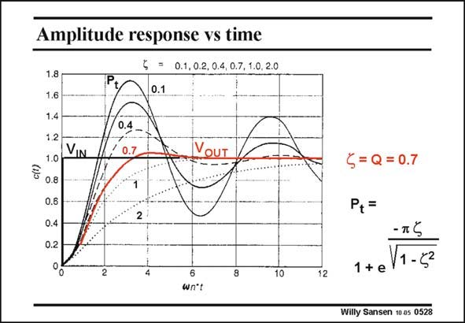

# SANSEN-0528 · Amplitude response vs time [ = 0.1,0.2, 0.4,0.7, 1.0,2.0

章节：05 运算放大器的稳定性  
PDF 页：159；书本页：163；幻灯片编号：0528  
状态：unreviewed



## 对应教材讲解

### PDF 159 · 书本 163

Peaking in the frequency domain corresponds to ringing in the time domain. To the same amplifier, we apply now an input voltage v which has a square IN waveform. The output voltage v follows with some OUT delay. For small values of f however, the output voltage overshoots, followed by ringing. The system is underdamped. The peak of the first overshoot P is t given. By taking a damping f of 0.7, the overshoot is very light and there is no ringing. A value of f of 0.87 would not give any overshoot at all. These values of f for no ringing are clearly similar to the values for no peaking. Ringing in the time domain and peaking in the frequency domain are clearly equivalent. The settling time is the time required to obtain the final value with a certain error. For example, a square waveform applied to a first-order system, gives an exponential with a certain time constant. For settling within 0.1%, we need to wait ln(1000) or 6.9 time constants. For a slightly underdamped two-pole system, it is not so obvious to find the 0.1% settling time. Certainly a f between 0.7 and 0.8 gives the best compromise between rise time and settling time.

## 公式／性能结论候选摘录

以下为规则截取的原文，尚未逐项判读。

（未由规则找到；不代表原页没有此类内容。）

## 曲线结论候选摘录

以下为规则截取的原文，尚未逐项判读。

- PDF 159: Peaking in the frequency domain corresponds to ringing in the time domain.
- PDF 159: The peak of the first overshoot P is t given.
- PDF 159: These values of f for no ringing are clearly similar to the values for no peaking.
- PDF 159: Ringing in the time domain and peaking in the frequency domain are clearly equivalent.

## 原文条件与近似候选摘录

以下为规则截取的原文，尚未逐项判读。

（未由规则找到；不代表原页没有此类内容。）

## 幻灯片 OCR（未校正）

```text
Amplitude response vs time
1.8
1.6
1.4
1.2
1.0
0.8
0.6
0.4
0.2
VIN
[ = 0.1,0.2, 0.4,0.7, 1.0,2.0
0.1
0.4-
0.7
VOUT
1
2
2
10
wn't
<= Q = 0.7
P+=
- T S
1 + e
V1 -52
12
Willy Sansen 10.05 0528
```

数学上下标、分数及正负号以原图为准。电路图已保留；未核对的连接不输出成可仿真 netlist。
