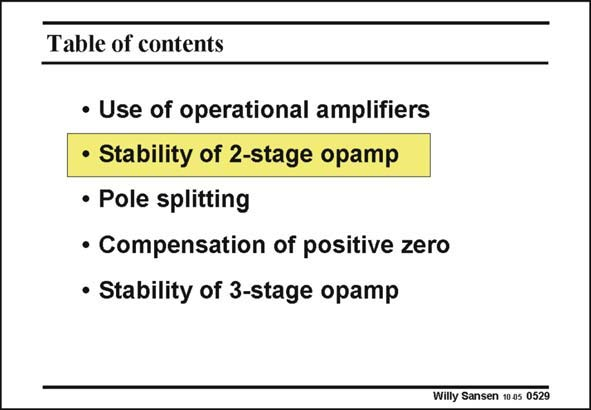

# SANSEN-0529 · Table of contents

章节：05 运算放大器的稳定性  
PDF 页：159；书本页：163；幻灯片编号：0529  
状态：unreviewed



## 对应教材讲解

### PDF 159 · 书本 163

Now that we know what it means to have a stable amplifier, or an amplifier without peaking or ringing, let us apply this theory now to a conventional two-stage amplifier.

## 公式／性能结论候选摘录

以下为规则截取的原文，尚未逐项判读。

（未由规则找到；不代表原页没有此类内容。）

## 曲线结论候选摘录

以下为规则截取的原文，尚未逐项判读。

- PDF 159: Now that we know what it means to have a stable amplifier, or an amplifier without peaking or ringing, let us apply this theory now to a conventional two-stage amplifier.

## 原文条件与近似候选摘录

以下为规则截取的原文，尚未逐项判读。

（未由规则找到；不代表原页没有此类内容。）

## 幻灯片 OCR（未校正）

```text
Table of contents
• Use of operational amplifiers
• Stability of 2-stage opamp
• Pole splitting
• Compensation of positive zero
• Stability of 3-stage opamp
Willy Sansen 10 as 0529
```

数学上下标、分数及正负号以原图为准。电路图已保留；未核对的连接不输出成可仿真 netlist。
