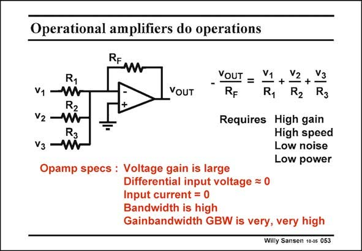

# SANSEN-053 · Operational amplifiers do operations

章节：05 运算放大器的稳定性  
PDF 页：146；书本页：150；幻灯片编号：053  
状态：unreviewed



## 对应教材讲解

### PDF 146 · 书本 150

Operational amplifiers have been used to carry out operations on analog signals with great precision. They allow the addition, subtraction, multiplication, etc. of analog voltages. This is shown in this slide for three input voltages. The output voltage is a precise sum of the input voltages, scaled by the corresponding resistors. This only works well provided the opamp itself has high gain up to high frequencies, with low noise, etc. High gain means that for any output voltage, the differential input voltage is about zero. The input currents are always zero if we use MOSTs and no bipolar transistors. In nanometer CMOS some Gate current may show up, giving rise to problems with the input currents! This means that the most important specification of an opamp is its gain and bandwidth or its gain bandwidth product GBW. We will optimize the GBW of an opamp for a certain capacitive load, towards minimum power consumption.

## 公式／性能结论候选摘录

以下为规则截取的原文，尚未逐项判读。

- PDF 146: This only works well provided the opamp itself has high gain up to high frequencies, with low noise, etc.
- PDF 146: High gain means that for any output voltage, the differential input voltage is about zero.
- PDF 146: This means that the most important specification of an opamp is its gain and bandwidth or its gain bandwidth product GBW.

## 曲线结论候选摘录

以下为规则截取的原文，尚未逐项判读。

（未由规则找到；不代表原页没有此类内容。）

## 原文条件与近似候选摘录

以下为规则截取的原文，尚未逐项判读。

- PDF 146: This only works well provided the opamp itself has high gain up to high frequencies, with low noise, etc.

## 幻灯片 OCR（未校正）

```text
Operational amplifiers do operations
RF
R1
VOUT
VOUT
-
RF
V1
V2
+
R1
R2
Vз
R3
R2
V2
V3
R3
Requires High gain
High speed
Low noise
Low power
Opamp specs : Voltage gain is large
Differential input voltage = 0
Input current = 0
Bandwidth is high
Gainbandwidth GBW is very, very high
Willy Sansen 10-05 053
```

数学上下标、分数及正负号以原图为准。电路图已保留；未核对的连接不输出成可仿真 netlist。
