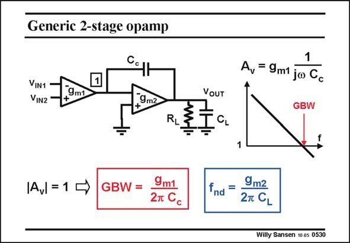

# SANSEN-0530 · Generic 2-stage opamp

章节：05 运算放大器的稳定性  
PDF 页：160；书本页：164；幻灯片编号：0530  
状态：unreviewed



## 对应教材讲解

### PDF 160 · 书本 164

A generic 2-stage amplifier is shown in this slide. It consists of a differential input stage, which converts the differential input voltage into a current, by transconductance g . A secondm1 stage follows, which is usually little more than a singletransistor amplifier, and which has a transconductance g . The output load m2 consists of both a resistor and a capacitor. The second stage has a feedback capacitor C . It c will be used to compensate this opamp. This is why it is called compensation capacitance. We will now try to find the gain, bandwidth and the gain-bandwidth product GBW. The gain is readily found by realizing that the second stage is actually a transresistance amplifier which converts the input current into the output voltage, by means of the impedance of capacitor C . c The gain A is then simply the product of the input g with the impedance of C . Obviously, v m1 c this gain A decreases with frequency, and crosses the unity-gain line at the frequency GBW. v The gain does not go to infinity at very low frequencies. It stops somewhere depending on whether cascodes are used, etc. The low-frequency gain is not that important after all. The higher frequency region is much more important, since feedback is always applied.

## 公式／性能结论候选摘录

以下为规则截取的原文，尚未逐项判读。

- PDF 160: We will now try to find the gain, bandwidth and the gain-bandwidth product GBW.
- PDF 160: The gain is readily found by realizing that the second stage is actually a transresistance amplifier which converts the input current into the output voltage, by means of the impedance of capacitor C . c The gain A is then simply the product of the input g with the impedance of C .
- PDF 160: Obviously, v m1 c this gain A decreases with frequency, and crosses the unity-gain line at the frequency GBW. v The gain does not go to infinity at very low frequencies.
- PDF 160: It stops somewhere depending on whether cascodes are used, etc.
- PDF 160: The low-frequency gain is not that important after all.

## 曲线结论候选摘录

以下为规则截取的原文，尚未逐项判读。

（未由规则找到；不代表原页没有此类内容。）

## 原文条件与近似候选摘录

以下为规则截取的原文，尚未逐项判读。

（未由规则找到；不代表原页没有此类内容。）

## 幻灯片 OCR（未校正）

```text
Generic 2-stage opamp
Cc
VIN1
VIN2
9m1
9m2
IAU = 1→
GBW =
9m1
27 Cc
VoUT
CL
1
A, = 9m1 ja Gc
GBW
RL
fnd =
9m2
2T CL
Willy Sansen 10.05 0530
```

数学上下标、分数及正负号以原图为准。电路图已保留；未核对的连接不输出成可仿真 netlist。
