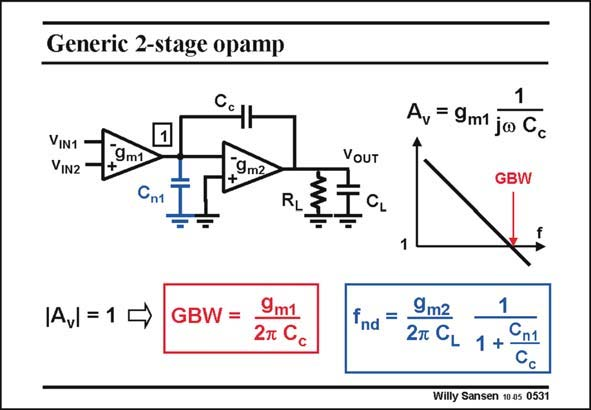

# SANSEN-0531 · Generic 2-stage opamp

章节：05 运算放大器的稳定性  
PDF 页：160；书本页：164；幻灯片编号：0531  
状态：unreviewed



## 对应教材讲解

### PDF 160 · 书本 164

The GBW is thus given by the frequency where the voltage gain is unity. Its expression is valid for all two-stage amplifiers! Remember that a singletransistor amplifier has a similar expression for the GBW. However, note that it contains the load capacitance. This two-stage opamp contains the compensation capacitance C instead. c For stability, we have to know the position of the non-dominant pole.

### PDF 161 · 书本 165

This pole f is determined by the other capacitance, i.e. the load capacitance C . The time nd L constant is given by the product of this load capacitance C and the resistance seen by it. This L is resistor R but especially resistance 1/g , offered by the second stage, across which C acts L m2 c as a short-circuit at these high frequencies, where f is expected to occur. nd Indeed the second stage is usually a single transistor. Its Drain is then connected to its Gate. Its resistance is simply 1/g . m2 Therefore, the non-dominant pole is mainly determined by time constant C /g . An exact L m2 calculation reveals that we have to take into account that a small capacitance C is present at n1 node 1. The capacitive division C /C is a kind of correction factor. We normally choose n1 c capacitor C to be at least three times larger than C . c n1

## 公式／性能结论候选摘录

以下为规则截取的原文，尚未逐项判读。

- PDF 160: The GBW is thus given by the frequency where the voltage gain is unity.
- PDF 161: Its resistance is simply 1/g . m2 Therefore, the non-dominant pole is mainly determined by time constant C /g .

## 曲线结论候选摘录

以下为规则截取的原文，尚未逐项判读。

（未由规则找到；不代表原页没有此类内容。）

## 原文条件与近似候选摘录

以下为规则截取的原文，尚未逐项判读。

（未由规则找到；不代表原页没有此类内容。）

## 幻灯片 OCR（未校正）

```text
Generic 2-stage opamp
VIN1
VIN2
9m1
9m2
Cn1
R,
|A = 10
GBW =
9m1
27 Cc
VoUT
CL
A, = 9m1 ja Gc
GBW
fnd =
9m2
1
2T CL 1 + .
Willy Sansen 10.05 0531
```

数学上下标、分数及正负号以原图为准。电路图已保留；未核对的连接不输出成可仿真 netlist。
