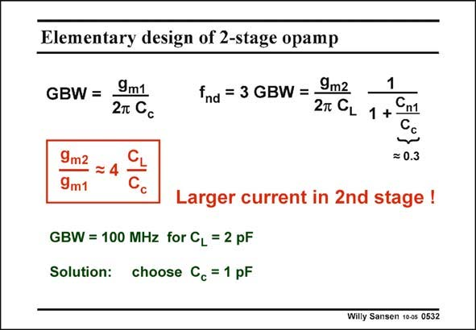

# SANSEN-0532 · Elementary design of 2-stage opamp

章节：05 运算放大器的稳定性  
PDF 页：161；书本页：165；幻灯片编号：0532  
状态：unreviewed



## 对应教材讲解

### PDF 161 · 书本 165

Both the GBW and the nondominant pole are linked by the stability requirement. The f /GBW must be nd about three! Rewriting this provides an important relationship between the trans-conductances on one hand, and the capacitances on the other. The correction factor C /C is simply taken to be n1 c 0.3. Combining this with the ratio f /GBW of three, we nd obtain a factor of 4. This relationship shows why the current in the second stage of a 2-stage opamp always consumes much more power than the first stage. Indeed for a specific V −V (such as 0.2 V), the transconductances represent GS T the currents. Normally, we choose the compensation capacitance to be smaller than the load capacitance. It is usually 2–3 times smaller. As a result, the current in the second stage is 8–12 times larger than the current in an input transistor. This relationship also shows that a redesign for larger C , requires either a larger C or a L c larger g . These are the two techniques, that we will use to compensate a two-stage opamp. m2 As an example, for a specific GBW and C , the equations can easily be solved to find the two L g ’s, provided we firstly choose C ! m c

## 公式／性能结论候选摘录

以下为规则截取的原文，尚未逐项判读。

- PDF 161: As a result, the current in the second stage is 8–12 times larger than the current in an input transistor.

## 曲线结论候选摘录

以下为规则截取的原文，尚未逐项判读。

（未由规则找到；不代表原页没有此类内容。）

## 原文条件与近似候选摘录

以下为规则截取的原文，尚未逐项判读。

- PDF 161: These are the two techniques, that we will use to compensate a two-stage opamp. m2 As an example, for a specific GBW and C , the equations can easily be solved to find the two L g ’s, provided we firstly choose C ! m c

## 幻灯片 OCR（未校正）

```text
Elementary design of 2-stage opamp
GBW =
9m1
2т Cc
fnd = 3 GBW =
9m2
1
27 GL 1 + Cm1
9m2
9m1
= 0.3
Larger current in 2nd stage!
GBW = 100 MHz for CL = 2 pF
Solution: choose Cc = 1 pF
Willy Sansen 10-05 0532
```

数学上下标、分数及正负号以原图为准。电路图已保留；未核对的连接不输出成可仿真 netlist。
